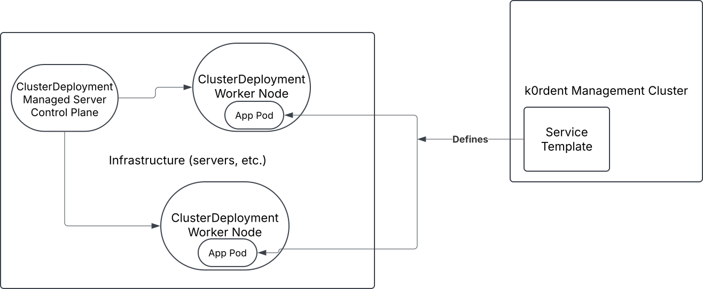
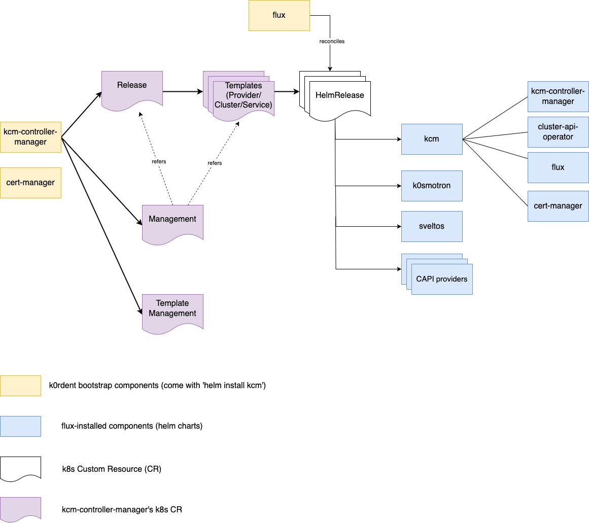

# Before you start

Before you start working with k0rdent, it helps to understand a few basics.

## How k0rdent works

k0rdent has several important subsystems, notably:

* **KCM - k0rdent Cluster Manager** - KCM wraps and manages Kubernetes Cluster API, and lets you treat clusters as 
Kubernetes objects. Within a k0rdent management cluster, you'll have a `ClusterDeployment` object that 
represents a deployed cluster, with `Machine` objects, and so on. When you create a `ClusterDeployment`, 
k0rdent deploys the cluster. When you delete it, k0rdent deletes it, and so on.
* **KSM - k0rdent Service Manager** - KSM wraps and manages several interoperating open source projects like Helm and Sveltos, which let you treat services and applications as Kubernetes objects.

Together, KCM and KSM interoperate to manifest a complete, template-driven system for defining and managing complete Internal Development Platforms (IDPs) comprising suites of services, plus a cluster and its components as realized on a particular cloud or infrastructure substrate. 

* **ClusterAPI providers**: ClusterAPI uses `providers` to manage different clouds and infrastructures, including bare metal. k0rdent ships with providers for AWS, Azure, OpenStack and vSphere, and you can add additional providers in order to control other clouds or infrastructures that ClusterAPI supports.

* **Templates**: When you create a cluster, that cluster is based on a template, which specifies all of the various information about
the cluster, such as where to find images, and so on. These templates get installed into k0rdent, but they don't do 
anything until you reference them in a `ClusterDeployment` that represents an actual cluster.

k0rdent can also manage these clusters, upgrading, scaling them, or installing software and services.

* **Services**: To add (or manage) services,
you also use templates. These `ServiceTemplate`s are like `ClusterTemplate`s, in that you install them into the cluster, but until
they're actually referenced, they don't do anything. When you reference a `ServiceTemplate` as part of a `ClusterDeployment`,
k0rdent knows to install that service into that cluster.

These services can be actual services, such as Nginx or Kyverno, or they can be user applications.

## How Credentials work

Of course you can't do any of this without permissions. As a human, you can log into, say, AWS, and tell it to create a new
instance on which you are going to install Kubernetes, but how does k0rdent get that permission? It gets it through the use of 
`Credential`s. 

When you create a `ClusterDeployment` or deploy an application, you include a reference to a `Credential` object that has been
installed in the k0rdent management cluster. Depending on whether the target infrastructure is AWS, Azure, or something else, that
`Credential` might reference an access key and secret, or it might reference a service provider, but all of that gets abstracted
out by the time you get to the `Credential`, which is what you'll actually reference.

By abstracting everything out to create a standard `Credential` object, users never have to have access to actual credentials (lowercase "c").
This enables the administrator to keep those credentials private, and to rotate them as necessary without disturbing users or
their applications. The administrator simply updates the `Credential` object and everything continues to work.

You can find more information on creating these `Credential`s in [the Credentials chapter](admin-credentials.md).

## k0rdent and GitOps

At its heart, k0rdent is a Kubernetes-native way to declaratively specify what should be happening in the infrastructure and
have that maintained. In other words, if you want to, say, scale up a cluster, you would give that cluster a new
definition that includes the additional nodes, and then k0rdent, seeing that reality doesn't match that definition, 
will make it happen.

In some ways that is very similar to GitOps, in which you commit definitions and tools such as Flux or ArgoCD 
ensure that reality matches the definition. We can say that k0rdent is GitOps-compatible, in the sense that you can (and should) consider storing k0rdent templates and YAML object definitions in Git repos, and can (and may want to) use GitOps tools like ArgoCD to modify and manage them upstream of k0rdent itself.

The main difference is that k0rdent's way of representing clusters and services is fully compliant with Kubernetes-native tools like ClusterAPI, Sveltos and Helm. So you can, in fact, port much of what you do with k0rdent templates and objects directly to other solution environments that leverage these standard tools.

# k0rdent initialization process

## The process

The k0rdent initialization process involves tools such as Helm and FluxCD.

1. [helm install kcm](admin-installation.md) brings up the bootstrap components (yellow on the picture above)
1. kcm-controller-manager sets up webhooks to validate its `CustomResource`s, then cert-manager handles the webhooks’ certificates
1. kcm-controller-manager generates `Release` object corresponding to the kcm helm chart version
1. kcm-controller-manager (or rather the [release-controller](https://github.com/k0rdent/kcm/blob/main/internal/controller/release_controller.go) inside it) generates template objects (`ProviderTemplate`/`ClusterTemplate`/`ServiceTemplate`) corresponding to a `Release` to be further processed
1. kcm-controller-manager generates a `HelmRelease` object for every template from p.3 (Important: it includes also kcm helm chart itself)
1. [Flux](https://github.com/fluxcd/flux2) (source-controller and helm-controller pods) reconciles the *HelmRelease* objects. In other words, it installs all the helm charts referred to in the templates.
**After this point, the deployment is completely controlled by Flux.**
1. kcm-controller-manager creates a `Management` object that refers to the above `Release` and the `ProviderTemplate` objects.
The `Management` object represents the k0rdent management cluster as a whole.
The management cluster Day-2 operations (such as [upgrade](admin-upgrading-k0rdent.md)) are  executed by manipulating the `Release` and `Management` objects.
1. kcm-controller-manager generates an empty `AccessManagement` object. `AccessManagement` defines [access rules](template-intro.md#template-life-cycle-management) for `ClusterTemplate`/`ServiceTemplate` propagation across user namespaces. Further `AccessManagement` might be edited and used along with admin-created `ClusterTemplateChain` and `ServiceTemplateChain` objects.