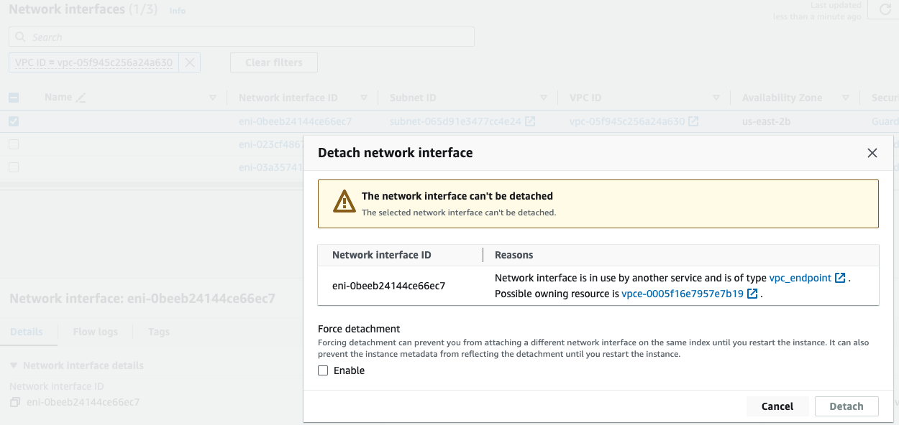

# AWS VPC Not Removed When Deleting EKS Cluster

A bug has been fixed in CAPA (Cluster API Provider AWS) for VPC removal: [kubernetes-sigs/cluster-api-provider-aws#5192](https://github.com/kubernetes-sigs/cluster-api-provider-aws/issues/5192)

If you find that a VPC has not been deleted, you can deal with it in three different ways:

## Applying ownership information on VPCs

When VPCs have owner information, all AWS resources will be removed when the k0rdent EKS cluster is deleted.
So after provisioning an EKS cluster, the operator can go and set tags (i.e. `tag:Owner`) and it will be 
sufficient for CAPA to manage them.

## GuardDuty VPCE

Another way to prevent an issue with non-deleted VPCs is to disable GuardDuty.
GuardDuty creates an extra VPCE (VPC Endpoint) not managed by CAPA and when CAPA 
starts EKS cluster removal, this VPCE does not get removed.

## Manual removal of VPCs

When it is impossible to turn off GuardDuty or applying ownership tags is not permitted, you need to remove VPCs manually.
Follow these steps.

1. Look for the affected VPC. The sign of “stuck” VPC looks like a hidden “Delete” button.

2. Open “Network Interfaces” and attempt to detach an interface. You will see a disabled “Detach” button:

3. It is required to get to VPC endpoints screen and remove the end-point: 

4. OK Endpoint deletion

5. Wait until VPCE is completely removed, all network interfaces disappear.

6. Now VPC can be finally removed:

