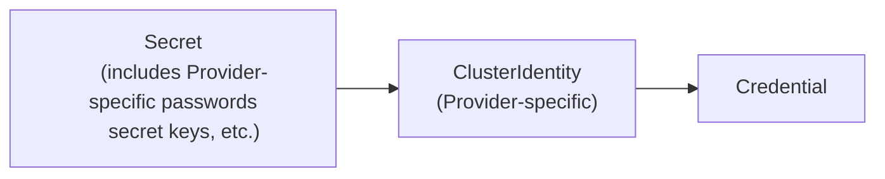

# Administering {{{ docsVersionInfo.k0rdentName }}}

Before you start working with {{{ docsVersionInfo.k0rdentName }}}, it helps to understand a few basics.

## How {{{ docsVersionInfo.k0rdentName }}} works

{{{ docsVersionInfo.k0rdentName }}} has several important subsystems, notably:

* **KCM - k0rdent Cluster Manager**: KCM wraps and manages Kubernetes Cluster API (ClusterAPI) and lets you treat clusters as
Kubernetes objects. Within a {{{ docsVersionInfo.k0rdentName }}} management cluster, you'll have a `ClusterDeployment` object that
represents a deployed cluster, with `Machine` objects, and so on. When you create a `ClusterDeployment`,
{{{ docsVersionInfo.k0rdentName }}} deploys the cluster, when you delete it, {{{ docsVersionInfo.k0rdentName }}} deletes it, and so on.
* **KSM - k0rdent State Manager**: KSM wraps and manages several interoperating open source projects such as Helm and Sveltos, which lets you treat services and applications as Kubernetes objects.

Together, KCM and KSM interoperate to create a complete, template-driven system for defining and managing Internal Development Platforms (IDPs) made up of suites of services, plus a cluster and its components as realized on a particular cloud or infrastructure substrate.

* **ClusterAPI providers**: ClusterAPI uses `providers` to manage different clouds and infrastructures, including bare metal. {{{ docsVersionInfo.k0rdentName }}} ships with providers for AWS, Azure, OpenStack and vSphere, and you can add additional providers in order to control other clouds or infrastructures that ClusterAPI supports.

* **Templates**: When you create a cluster, that cluster is based on a template, which specifies all of the various information about the cluster, such as where to find images, and so on. These templates get installed into {{{ docsVersionInfo.k0rdentName }}}, but they don't do anything until you reference them in a `ClusterDeployment` that represents an actual cluster.

    ```mermaid
    graph LR;
        subgraph Infrastructure
            WN1["ClusterDeployment Worker Node"]
            CP["ClusterDeployment Managed Server Control Plane"]
            WN2["ClusterDeployment Worker Node"]
        end

        subgraph "{{{ docsVersionInfo.k0rdentName }}} Mgmnt Cluster"
            CT["Cluster Template"]
            P["Provider"]
        end

        CP -->|Controls| WN1
        CP -->|Controls| WN2
        CT -->|Defines| CP & WN1 & WN2
        P -->|Provisions| Infrastructure

    ```

    {{{ docsVersionInfo.k0rdentName }}} can also manage these clusters, upgrading them, scaling them, or installing software and services.

* **Services**: To add (or manage) services, you also use templates. These `ServiceTemplate` objects are like `ClusterTemplate` objects, in that you install them into the cluster, but until they're actually referenced, they don't do anything. When you reference a `ServiceTemplate` as part of a `ClusterDeployment`, {{{ docsVersionInfo.k0rdentName }}} knows to install that service into that cluster.

    ```mermaid
    graph TB;
        
        subgraph "{{{ docsVersionInfo.k0rdentName }}} Mgmnt Cluster"
            ST["Service Template"]
        end

        subgraph Infrastructure
            CP["ClusterDeployment Managed Server Control Plane"]
            
            subgraph WN1["Worker Node"]
            POD1[App]
            end
            
            subgraph WN2["Worker Node"]
            POD2[App]
            end
        end
        CP -->|Controls| WN1
        CP -->|Controls| WN2
        POD1 -->|Defined By| ST
        POD2 -->|Defined By| ST

    ```


    These services can be actual services, such as Nginx or Kyverno, or they can be user applications.

## How Credentials work

Of course you can't do any of this without permissions. As a human, you can log into, say, AWS, and tell it to create a new
instance on which you are going to install Kubernetes, but how does {{{ docsVersionInfo.k0rdentName }}} get that permission? It gets it through the use of
`Credential` objects.

When you create a `ClusterDeployment` or deploy an application, you include a reference to a `Credential` object that has been
installed in the {{{ docsVersionInfo.k0rdentName }}} management cluster. Depending on whether the target infrastructure is AWS, Azure, or something else, that
`Credential` might reference an access key and secret, or it might reference a service provider, but all of that gets abstracted
out by the time you get to the `Credential`, which is what you'll actually reference.



By abstracting everything out to create a standard `Credential` object, users never have to have access to actual credentials (lowercase "c"). This enables the administrator to keep those credentials private, and to rotate them as necessary without disturbing users or their applications. The administrator simply updates the `Credential` object and everything continues to work.

You can find more information on creating these `Credential` objects in [the Credentials chapter](access/credentials/index.md).

## {{{ docsVersionInfo.k0rdentName }}} and GitOps

At its heart, {{{ docsVersionInfo.k0rdentName }}} is a Kubernetes-native way to declaratively specify what should be happening in the infrastructure and
have that maintained. In other words, if you want to, say, scale up a cluster, you would give that cluster a new
definition that includes the additional nodes, and then {{{ docsVersionInfo.k0rdentName }}}, seeing that reality no longer matches the definition, it will [reconcile](https://kubebyexample.com/learning-paths/operator-framework/operator-sdk-go/controller-reconcile-function) the difference.

In some ways this way of working is similar to GitOps, in which you commit definitions and tools such as Flux or ArgoCD
ensure that reality matches the definition. We can say that {{{ docsVersionInfo.k0rdentName }}} is GitOps-compatible, in the sense that you can (and should) consider storing {{{ docsVersionInfo.k0rdentName }}} templates and YAML object definitions in Git repos, and can (and may want to) use GitOps tools like ArgoCD to modify and manage them upstream of {{{ docsVersionInfo.k0rdentName }}} itself.

The main difference is that {{{ docsVersionInfo.k0rdentName }}}'s way of representing clusters and services is fully compliant with Kubernetes-native tools like ClusterAPI, Sveltos and Helm. So you could, if you needed to, port much of what you do with {{{ docsVersionInfo.k0rdentName }}} templates and objects directly to other solution environments that leverage these standard tools.

## The {{{ docsVersionInfo.k0rdentName }}} initialization process


### The process

The {{{ docsVersionInfo.k0rdentName }}} initialization process involves tools such as Helm and FluxCD.

1. [`helm install kcm`](installation/install-k0rdent.md) brings up the bootstrap components (yellow in the above diagram).
1. `kcm-controller-manager` sets up webhooks to validate its `CustomResource` objects, then cert-manager handles the webhooks’ certificates.
1. `kcm-controller-manager` generates a `Release` object corresponding to the KCM helm chart version.
1. `kcm-controller-manager` (or rather the [release-controller](https://github.com/k0rdent/kcm/blob/main/internal/controller/release_controller.go) inside it) generates template objects (`ProviderTemplate`/`ClusterTemplate`/`ServiceTemplate`) corresponding to a `Release` to be further processed.
1. `kcm-controller-manager` generates a `HelmRelease` object for every standard template. Note that this includes the KCM helm chart itself.
1. [Flux](https://github.com/fluxcd/flux2) (source-controller and helm-controller pods) reconciles the *HelmRelease* objects. In other words, it installs all the helm charts referred to in the templates.
**After this point, the deployment is completely controlled by Flux.**
1. `kcm-controller-manager` creates a `Management` object that refers to the above `Release` and the `ProviderTemplate` objects.
The `Management` object represents the {{{ docsVersionInfo.k0rdentName }}} management cluster as a whole.
The management cluster Day-2 operations (such as [upgrade](upgrade/index.md)) are  executed by manipulating the `Release` and `Management` objects.
1. `kcm-controller-manager` generates an empty `AccessManagement` object. `AccessManagement` defines [access rules](../reference/template/index.md#template-life-cycle-management) for `ClusterTemplate`/`ServiceTemplate` propagation across user namespaces. Further, the `AccessManagement` might be edited and used along with admin-created `ClusterTemplateChain` and `ServiceTemplateChain` objects.

This Administration Guide provides information on:

- [Installing and preparing {{{ docsVersionInfo.k0rdentName }}} for use](installation/index.md)
- [Working with clusters](clusters/index.md)
- [Working with services](services/index.md)
- [Hosted control planes](hosted-control-plane/index.md)
- [{{{ docsVersionInfo.k0rdentName }}} Observability & FinOps](kof/index.md)
- [Upgrading {{{ docsVersionInfo.k0rdentName }}}](upgrade/index.md)
- [Access Management (Credentials and RBAC)](access/index.md)
- [Backup and Restore](backup/index.md)
