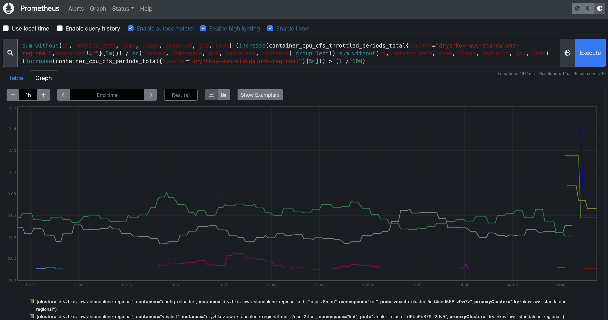
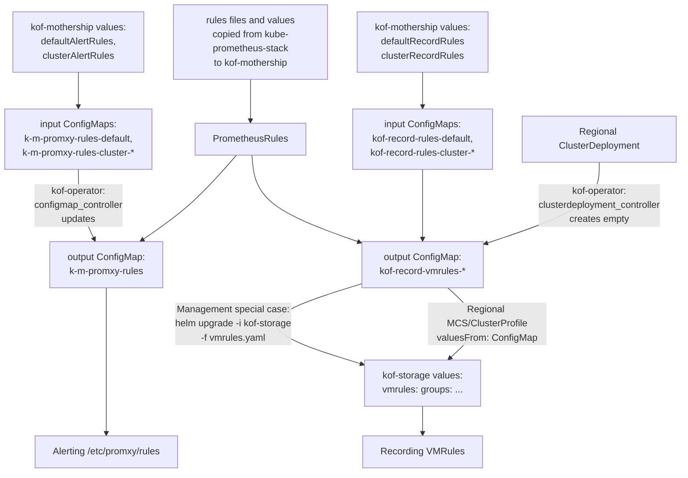
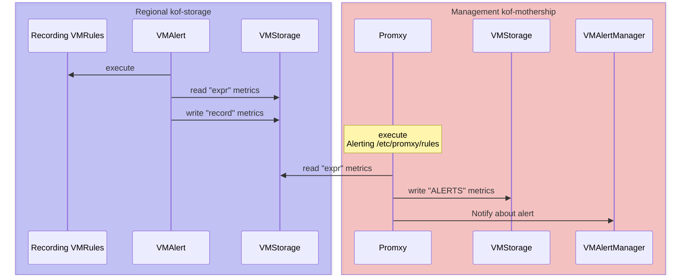

# KOF Alerts

## Summary

At this point you have metrics collected and visualized. It is important to check them manually,
but it is even better to **automate detection and notification about the issues found in the data.**

We believe the rules should be configured using YAML IaC (Infrastructure as Code),
while you can perform temporary management such as [Silences](https://grafana.com/docs/grafana/latest/alerting/configure-notifications/create-silence/)
using the UI.

[Alerting rules](https://prometheus.io/docs/prometheus/latest/configuration/alerting_rules/)
and [recording rules](https://prometheus.io/docs/prometheus/latest/configuration/recording_rules/#recording-rules)
in KOF are based on the [PrometheusRules](https://github.com/prometheus-community/helm-charts/tree/5a42485c22e5beb3da772b32fbfd18719793bc5e/charts/kube-prometheus-stack/templates/prometheus/rules-1.14)
from the [kube-prometheus-stack](https://github.com/prometheus-community/helm-charts/tree/main/charts/kube-prometheus-stack#readme) chart
with per-cluster [customization](#custom-rules) options.

KOF uses the [data source managed rules](https://grafana.com/docs/grafana/latest/alerting/fundamentals/alert-rules/#data-source-managed-alert-rules)
to store and [execute](#execution-of-rules) recording rules in regional clusters closer to the source data,
and to reduce the load on Grafana, even for alerting rules executed by Promxy in the management cluster.

Promxy is used as a data source and executor of alerting rules
instead of [VMAlert](https://docs.victoriametrics.com/operator/resources/vmalert/) because:

* As the [Promxy FAQ](https://github.com/jacksontj/promxy/tree/v0.0.93?tab=readme-ov-file#how-do-i-use-alertingrecording-rules-in-promxy) says, "for example, if you wanted to know that the global error rate was < 10%,
    this would be impossible on the individual prometheus hosts
    (without federation, or re-scraping) but trivial in promxy."

* It fixes the "See graph" button in the Grafana Alerting rules UI,
    as Grafana gets the metrics from all regional clusters via Promxy.

[VMAlertManager](https://docs.victoriametrics.com/operator/resources/vmalertmanager/)
aggregates and sends alerts to various receivers like Slack
with [advanced routing](#advanced-routing) options.

Let's start with the demo of an alert sent and received.

## Alertmanager Demo

1. Open the [https://webhook.site/](https://webhook.site/) and save "Your unique URL"
    for the next step.

1. Add the following to the `mothership-values.yaml` file, replacing `$WEBHOOK_URL` with the URL from step 1:
    ```yaml
    victoriametrics:
      vmalert:
        vmalertmanager:
          config: |
            route:
              receiver: webhook
            receivers:
              - name: webhook
                webhook_configs:
                  - url: $WEBHOOK_URL
    ```

3. Apply the `mothership-values.yaml` file as described in the [Management Cluster](./kof-install.md#management-cluster) section.

4. Wait until the [https://webhook.site/](https://webhook.site/)
    shows the `Watchdog` alert, as in:
    ```json
    {
      "receiver": "webhook",
      "status": "firing",
      "alerts": [
        {
          "status": "firing",
          "labels": {
            "alertgroup": "general.rules",
            "alertname": "Watchdog",
            "severity": "none",
            "source": "promxy"
          },
          "annotations": {
            "description": "This is an alert meant to ensure that the entire alerting pipeline is functional...",
            "runbook_url": "https://runbooks.prometheus-operator.dev/runbooks/general/watchdog",
            "summary": "An alert that should always be firing to certify that Alertmanager is working properly."
          },
          "startsAt": "2025-06-02T10:27:29.14Z",
          "endsAt": "0001-01-01T00:00:00Z",
          "generatorURL": "http://127.0.0.1:8082/...",
    ```

## Advanced Routing

The configuration of the [Alertmanager Demo](#alertmanager-demo) is very basic.

Please use these guides to apply advanced routing options:

* [Prometheus Alertmanager configuration reference](https://prometheus.io/docs/alerting/latest/configuration/#file-layout-and-global-settings) - all possible options.

* [VMAlertManager Slack example](https://github.com/VictoriaMetrics/VictoriaMetrics/blob/v1.118.0/docs/victoriametrics-cloud/alertmanager-setup-for-deployment.md#configuration-example) -
    a multichannel notification system to ensure that critical alerts
    are promptly delivered to the responsible teams.

* [Matchers](https://prometheus.io/docs/alerting/latest/configuration/#composition-of-matchers) -
    configurable routing rules that determine where and how alerts are directed
    (for example, email, Slack, PagerDuty) based on severity, source, or other attributes.

* [Grouping](https://prometheus.io/docs/alerting/latest/alertmanager/#grouping) and
    [example from Prometheus](https://prometheus.io/docs/alerting/latest/configuration/#example)
    with `group_by: [cluster, alertname]` -
    you may want to use `group_by: [alertgroup, alertname]` instead
    for alert correlation across clusters to identify systemic issues and reduce noise
    when the same alert fires in multiple clusters.

## Alertmanager UI

To access the Alertmanager UI:

1. In the management cluster, forward the alertmanager port:
    ```bash
    kubectl port-forward -n kof svc/vmalertmanager-cluster 9093:9093
    ```

2. Open [http://127.0.0.1:9093/](http://127.0.0.1:9093/)
    and check tabs such as "Alerts" and "Silences".

See the demo in the [Grafana Alerting UI](#grafana-alerting-ui) section
where Alertmanager UI shows the same data.

## Grafana Alerting UI

To access the Grafana Alerting UI:

1. Apply the [Access to Grafana](./kof-using.md/#access-to-grafana) step.

2. Open: Grafana - Alerting - and then "Alert rules" or "Silences", like this:


## Prometheus UI

There are few places where you can find the graph of the firing alert:

1. Grafana - Alerting - Alert rules - rule - See graph.

    This shows the graph in Grafana UI,
    as in the [Grafana Alerting UI](#grafana-alerting-ui) demo above.

2. Grafana - Alerting - Groups - group - alert - See source - Graph.

    This shows the graph in Prometheus UI.

3. The same Prometheus UI link is sent to receiver like Slack in `generatorURL` field,
    as shown in the [Alertmanager Demo](#alertmanager-demo).

The Prometheus UI looks like this:



To enable Promxy Prometheus UI, please run this command in the management cluster:

```bash
kubectl port-forward -n kof svc/kof-mothership-promxy 8082:8082
```

If you expose the Prometheus UI with some external domain,
please set `promxy.extraArgs."web.external-url"` in `mothership-values.yaml` file
and reapply it as described in the [Management Cluster](./kof-install.md#management-cluster) section.

## Custom rules

You can update or create rules for all or specific clusters in a centralized way,
passing [values](https://github.com/k0rdent/kof/blob/332f66ff03bae8abd37cc7e754dd8d7a42d059a7/charts/kof-mothership/values.yaml#L484-L537)
to the `kof-mothership` chart [installed in the management cluster](./kof-install.md#management-cluster).

For example, let's update the `CPUThrottlingHigh` alert in the `kubernetes-resources` group:

1. Note the [original alert](https://github.com/k0rdent/kof/blob/332f66ff03bae8abd37cc7e754dd8d7a42d059a7/charts/kof-mothership/templates/prometheus/rules/kubernetes-resources.yaml#L250-L281)
    in the `PrometheusRule` has the threshold `> ( 25 / 100 )`.

2. Add this cluster-specific patch to the `mothership-values.yaml` file:
    ```yaml
    clusterAlertRules:
      cluster1:
        kubernetes-resources:
          CPUThrottlingHigh:
            expr: |-
              sum(increase(container_cpu_cfs_throttled_periods_total{cluster="cluster1", container!=""}[5m])) without (id, metrics_path, name, image, endpoint, job, node)
                / on (cluster, namespace, pod, container, instance) group_left
              sum(increase(container_cpu_cfs_periods_total{cluster="cluster1"}[5m])) without (id, metrics_path, name, image, endpoint, job, node)
                > ( 42 / 100 )
    ```
    Note the `cluster="cluster1"` filters and the `> ( 42 / 100 )` threshold.

3. Add a similar patch for `cluster10` to the same `clusterAlertRules`.

4. Now that we have special `CPUThrottlingHigh` alerts for `cluster1` and `cluster10`,
    we want to exclude these clusters from the default `CPUThrottlingHigh` alert
    to avoid the ambiguity of which threshold fires this alert in each cluster.

    Add this patch to the same file:
    ```yaml
    defaultAlertRules:
      kubernetes-resources:
        CPUThrottlingHigh:
          expr: |-
            sum(increase(container_cpu_cfs_throttled_periods_total{cluster!~"^cluster1$|^cluster10$", container!=""}[5m])) without (id, metrics_path, name, image, endpoint, job, node)
              / on (cluster, namespace, pod, container, instance) group_left
            sum(increase(container_cpu_cfs_periods_total{cluster!~"^cluster1$|^cluster10$"}[5m])) without (id, metrics_path, name, image, endpoint, job, node)
              > ( 25 / 100 )
    ```
    Note the `cluster!~"^cluster1$|^cluster10$"` filters and the default threshold.

5. You can also update or create recording rules [in the same way](https://github.com/k0rdent/kof/blob/332f66ff03bae8abd37cc7e754dd8d7a42d059a7/charts/kof-mothership/values.yaml#L511-L537),
    but the whole rule group should be redefined, because the `record` field is not unique.

6. You may update or create more rules,
    like the `ContainerHighMemoryUsage` alert that was added [on demand](https://github.com/k0rdent/kof/pull/317)
    from the [awesome-prometheus-alerts](https://github.com/samber/awesome-prometheus-alerts) collection.

7. Apply the `mothership-values.yaml` file as described in the [Management Cluster](./kof-install.md#management-cluster) section.

## Generation of rules

The next steps are automated:



* Rules patches (empty by default) are rendered from `kof-mothership` values
    to the input `ConfigMaps`, which are merged with upstream `PrometheusRules`,
    [generating](https://github.com/k0rdent/kof/blob/332f66ff03bae8abd37cc7e754dd8d7a42d059a7/kof-operator/internal/controller/configmap_controller.go#L108-L167)
    the output `ConfigMaps`.

    * If you want to protect some output `ConfigMap` from automatic changes,
        set its label `k0rdent.mirantis.com/kof-generated: "false"`

* Alerting rules are mounted to Promxy in the management cluster as `/etc/promxy/rules`.

* Recording rules are passed via `MultiClusterService` (or `ClusterProfile` for `istio` case)
    to each regional cluster where `kof-storage` chart renders them to `VMRules`.

## Mothership recording rules

If you've [selected to store](./kof-storing.md) KOF data of the management cluster
in the same management cluster, then:

1. Copy the generated mothership recording rules from the output `ConfigMap` to a YAML file:
    ```bash
    kubectl get cm -n kof kof-record-vmrules-mothership -o yaml \
    | yq -r .data.values > vmrules.yaml
    ```

2. Add `-f vmrules.yaml` to the `helm upgrade ... kof-storage` command
    described in the [From Management to Management](./kof-storing.md#from-management-to-management) section
    and apply it.

## Execution of rules

Details of where and how the recording and alerting rules are executed:



* Recording `VMRules` are executed by `VMAlert`, reading and writing to `VMStorage` -
    all this happens in `kof-storage` in each regional cluster.

    The [From Management to Management](./kof-storing.md#from-management-to-management) case is special:
    `VMRules` are provided by `kof-storage` chart in the management cluster,
    while `VMAlert` and `VMStorage` are provided by `kof-mothership` -
    to avoid having two VictoriaMetrics engines in the same cluster.

* Alerting rules are executed by Promxy in `kof-mothership` in the management cluster,
    reading metrics from all regional `VMStorages`,
    writing to the management `VMStorage`,
    and notifying `VMAlertManager` in the management cluster.
