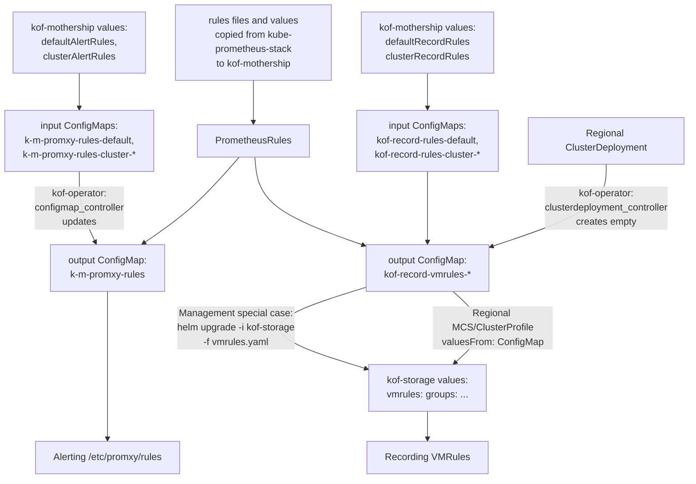
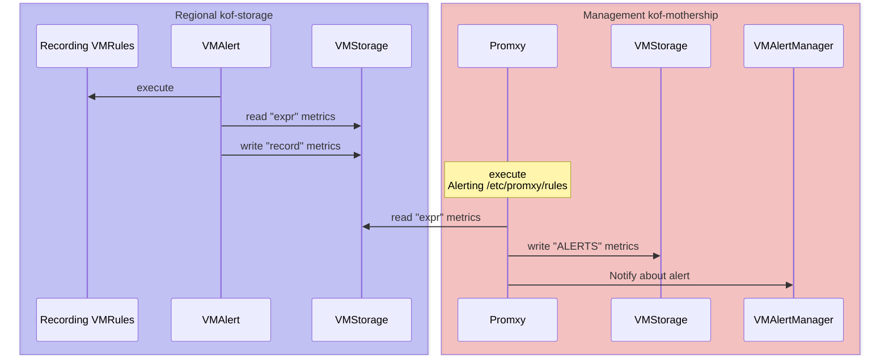

# KOF Alerts

KOF uses the [data source managed rules](https://grafana.com/docs/grafana/latest/alerting/fundamentals/alert-rules/#data-source-managed-alert-rules):

* to store and execute rules closer to the source data,
* to reduce the load on Grafana,
* to improve scalability and performance when handling large volumes of alerts.

We believe the rules should be configured using YAML IaC (Infrastructure as Code),
while temporary management like adding "Silences" can be done using UI.

Alerting and recording rules in KOF are based on the [PrometheusRules](https://github.com/prometheus-community/helm-charts/tree/5a42485c22e5beb3da772b32fbfd18719793bc5e/charts/kube-prometheus-stack/templates/prometheus/rules-1.14)
from the [kube-prometheus-stack](https://github.com/prometheus-community/helm-charts/tree/main/charts/kube-prometheus-stack#readme).

## Custom rules

You can update or create rules for all or specific clusters in a centralized way,
passing [values](https://github.com/k0rdent/kof/blob/332f66ff03bae8abd37cc7e754dd8d7a42d059a7/charts/kof-mothership/values.yaml#L484-L537)
to the `kof-mothership` chart [installed in the management cluster](./kof-install.md#management-cluster).

For example, let's update `CPUThrottlingHigh` alert in the `kubernetes-resources` group:

1. Note the [original alert](https://github.com/k0rdent/kof/blob/332f66ff03bae8abd37cc7e754dd8d7a42d059a7/charts/kof-mothership/templates/prometheus/rules/kubernetes-resources.yaml#L250-L281)
    in the `PrometheusRule` has the threshold `> ( 25 / 100 )`.

2. Add this cluster-specific patch to the `mothership-values.yaml` file:
    ```yaml
    clusterAlertRules:
      cluster1:
        kubernetes-resources:
          CPUThrottlingHigh:
            expr: |-
              sum(increase(container_cpu_cfs_throttled_periods_total{cluster="cluster1", container!="", job="kubelet", metrics_path="/metrics/cadvisor", }[5m])) without (id, metrics_path, name, image, endpoint, job, node)
                / on (cluster, namespace, pod, container, instance) group_left
              sum(increase(container_cpu_cfs_periods_total{cluster="cluster1", job="kubelet", metrics_path="/metrics/cadvisor", }[5m])) without (id, metrics_path, name, image, endpoint, job, node)
                > ( 42 / 100 )
    ```
    Note the `cluster="cluster1"` filters and the `> ( 42 / 100 )` threshold.

3. Add a similar patch for the `cluster10` to the same file.

4. Now that we have special `CPUThrottlingHigh` alerts for `cluster1` and `cluster10`,
    we want to exclude these clusters from the default `CPUThrottlingHigh` alert
    to avoid the ambiguity of which threshold fires this alert in each cluster.

    Add this patch to the same file:
    ```yaml
    defaultAlertRules:
      kubernetes-resources:
        CPUThrottlingHigh:
          expr: |-
            sum(increase(container_cpu_cfs_throttled_periods_total{cluster!~"^cluster1$|^cluster10$", container!="", job="kubelet", metrics_path="/metrics/cadvisor", }[5m])) without (id, metrics_path, name, image, endpoint, job, node)
              / on (cluster, namespace, pod, container, instance) group_left
            sum(increase(container_cpu_cfs_periods_total{cluster!~"^cluster1$|^cluster10$", job="kubelet", metrics_path="/metrics/cadvisor", }[5m])) without (id, metrics_path, name, image, endpoint, job, node)
              > ( 25 / 100 )
    ```
    Note the `cluster!~"^cluster1$|^cluster10$"` filter and the default threshold.

5. You can also update or create recording rules [in the same way](https://github.com/k0rdent/kof/blob/332f66ff03bae8abd37cc7e754dd8d7a42d059a7/charts/kof-mothership/values.yaml#L511-L537),
    but the whole rule group should be redefined, because the `record` field is not unique.

6. Apply the `mothership-values.yaml` file as described in the [Management Cluster](./kof-install.md#management-cluster) section.

## Generation of rules

The next steps are automated:



* Rules patches (empty by default) are rendered from the `mothership-values.yaml`
    to the input `ConfigMaps`, which are merged with upstream `PrometheusRules`,
    [generating](https://github.com/k0rdent/kof/blob/332f66ff03bae8abd37cc7e754dd8d7a42d059a7/kof-operator/internal/controller/configmap_controller.go#L108-L167)
    the output `ConfigMaps`.

    * If you want to protect some output `ConfigMap` from automatic changes,
        set its label `k0rdent.mirantis.com/kof-generated: "false"`

* Alerting rules are mounted to Promxy in the management cluster as `/etc/promxy/rules`.

* Recording rules are passed via `MultiClusterService` (or `ClusterProfile` for `istio` case)
    to each regional cluster where `kof-storage` chart renders them to `VMRules`.

## Mothership recording rules

If you've [selected to store](./kof-storing.md) KOF data of the management cluster
in the same management cluster, then:

1. Copy the generated mothership recording rules from the output `ConfigMap` to YAML file:
    ```shell
    kubectl get cm -n kof kof-record-vmrules-mothership -o yaml \
    | yq -r .data.values > vmrules.yaml
    ```

2. Add `-f vmrules.yaml` to the `helm upgrade ... kof-storage` command
    described in the [From Management to Management](./kof-storing.md#from-management-to-management) section
    and apply it.

## Execution of rules



* Recording `VMRules` are executed by `VMAlert`, reading and writing to `VMStorage`.
    * All this happens in `kof-storage` in each regional cluster.
    * The [From Management to Management](./kof-storing.md#from-management-to-management) case is special:
        `VMRules` are provided by `kof-storage` chart in the management cluster,
        while `VMAlert` and `VMStorage` are provided by `kof-mothership` -
        to avoid having two VictoriaMetrics engines in the same cluster.

* Alerting rules are:
    * executed by the `kof-mothership` Promxy in the management cluster,
    * reading metrics from all regional `VMStorages`,
    * writing to the management `VMStorage`,
    * and notifying `VMAlertManager` in the management cluster.

## VMAlertManager

`VMAlertManager` aggregates and sends alerts to various receivers like Slack.

### Minimal test

1. Add to the `mothership-values.yaml` file:
    ```yaml
    victoriametrics:
      vmalert:
        vmalertmanager:
          config: |
            route:
              receiver: webhook
            receivers:
              - name: webhook
                webhook_configs:
                  - url: $WEBHOOK_URL
    ```

2. Open the [https://webhook.site/](https://webhook.site/), copy "Your unique URL",
    and paste it instead of `$WEBHOOK_URL` above.

3. Apply the `mothership-values.yaml` file as described in the [Management Cluster](./kof-install.md#management-cluster) section.

4. Wait a bit until the [https://webhook.site/](https://webhook.site/)
    shows the `Watchdog` alert like this:
    ```json
    {
      "receiver": "webhook",
      "status": "firing",
      "alerts": [
        {
          "status": "firing",
          "labels": {
            "alertgroup": "general.rules",
            "alertname": "Watchdog",
            "severity": "none",
            "source": "promxy"
          },
          "annotations": {
            "description": "This is an alert meant to ensure that the entire alerting pipeline is functional...",
            "runbook_url": "https://runbooks.prometheus-operator.dev/runbooks/general/watchdog",
            "summary": "An alert that should always be firing to certify that Alertmanager is working properly."
          },
          "startsAt": "2025-06-02T10:27:29.14Z",
          "endsAt": "0001-01-01T00:00:00Z",
          "generatorURL": "http://kof-mothership-promxy-...",
    ```

### Advanced routing

Now you can update the `config` above using:

* [Prometheus Alertmanager configuration reference](https://prometheus.io/docs/alerting/latest/configuration/#file-layout-and-global-settings) - all possible options.

* [VMAlertManager Slack multichannel example](https://github.com/VictoriaMetrics/VictoriaMetrics/blob/v1.118.0/docs/victoriametrics-cloud/alertmanager-setup-for-deployment.md#configuration-example).

* [Routing based on severity, etc](https://prometheus.io/docs/alerting/latest/configuration/#composition-of-matchers).

* [Example from Prometheus](https://prometheus.io/docs/alerting/latest/configuration/#example)
    with `group_by: [cluster, alertname]` - see [Grouping docs](https://prometheus.io/docs/alerting/latest/alertmanager/#grouping).

* You may want to use `group_by: [alertgroup, alertname]` instead -
    for alert correlation across clusters to identify systemic issues and reduce noise
    when the same alert fires in multiple clusters.

### Alertmanager UI

To access the Alertmanager UI:

1. Run in the management cluster:
    ```shell
    kubectl port-forward -n kof svc/vmalertmanager-cluster 9093:9093
    ```

2. Open [http://127.0.0.1:9093/](http://127.0.0.1:9093/)
    and check the tabs like "Alerts" and "Silences".

## Grafana Alerting UI

To access Grafana Alerting UI:

1. Apply the [Access to Grafana](./kof-using.md/#access-to-grafana) step.

2. In Grafana UI open the "Alerting" and then "Alert rules" or "Silences", like this:

TODO: Demo video will be added here soon.
