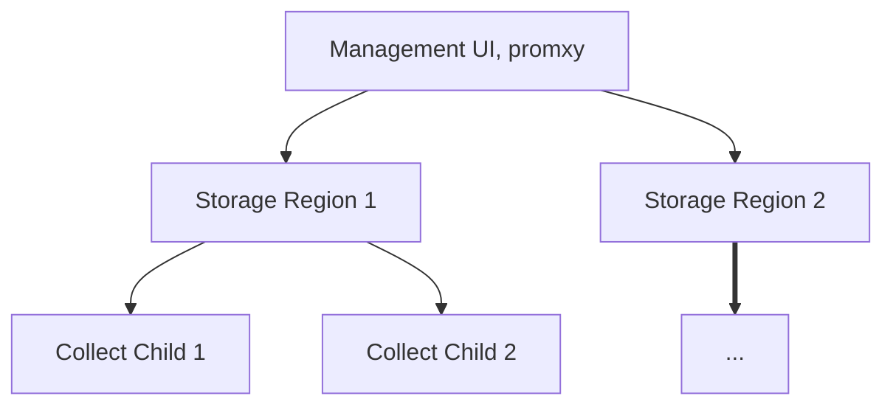

# Architecture

## High-level

From a high-level perspective, KOF consists of three layers:

* the Collection layer, where the statistics and events are gathered,
* the Regional layer, which includes storage to keep track of those statistics and events,
* and the Management layer, where you interact through the UI.

## Mid-level

Getting a little bit more detailed, it's important to undrestand that data flows upwards,
from observed objects to centralized Grafana on the Management layer:

<!--

To update the diagram:
* Update the indented text below.
* Copy/paste it to https://codepen.io/denis-ryzhkov/pen/ByajZeJ
* Copy the resulting HTML.
* Please preserve custom `max-width: 30em;` in the end.

<b>Management Cluster</b>
  kof-mothership chart
    grafana-operator
    victoria-metrics-operator
    cluster-api-visualizer
    sveltos-dashboard
    k0rdent service templates
    promxy

  kof-operators chart
    opentelemetry-operator
    prometheus-operator-crds

Cloud 1..N
  Region 1..M

    <b>Regional Cluster</b>
      kof-storage chart
        grafana-operator
        victoria-metrics-operator
        victoria-logs-single
        external-dns

      cert-manager of grafana and vmauth
      ingress-nginx

    <b>Child Cluster 1</b>
      cert-manager of OTel-operator

      kof-operators chart
        opentelemetry-operator
          OpenTelemetryCollector
        prometheus-operator-crds

      kof-collectors chart
        opencost
        kube-state-metrics
        prometheus-node-exporter

      observed objects
-->

  <b>Management Cluster</b>
  

    kof-mothership chart
    

      grafana-operator
    

    

      victoria-metrics-operator
    

    

      cluster-api-visualizer
    

    

      sveltos-dashboard
    

    

      k0rdent service templates
    

    

      promxy
    

  

  

    kof-operators chart
    

      opentelemetry-operator
    

    

      prometheus-operator-crds
    

  

  Cloud 1..N
  

    Region 1..M
    

      <b>Regional Cluster</b>
      

        kof-storage chart
        

          grafana-operator
        

        

          victoria-metrics-operator
        

        

          victoria-logs-single
        

        

          external-dns
        

      

      

        cert-manager of grafana and vmauth
      

      

        ingress-nginx
      

    

    

      <b>Child Cluster 1</b>
      

        cert-manager of OTel-operator
      

      

        kof-operators chart
        

          opentelemetry-operator
          

            OpenTelemetryCollector
          

        

        

          prometheus-operator-crds
        

      

      

        kof-collectors chart
        

          opencost
        

        

          kube-state-metrics
        

        

          prometheus-node-exporter
        

      

      

        observed objects
      

    

  

## Low-level

At a low level, you can see how logs and traces work their way around the system.

