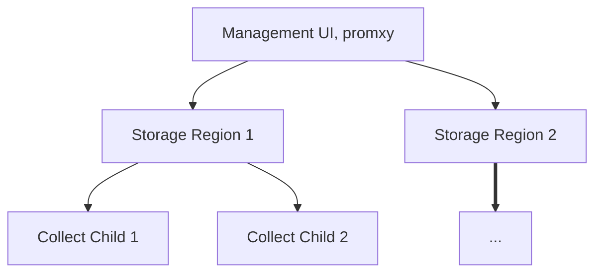

# Architecture

## High-level

From a high-level perspective, KOF consists of three layers:

* the Collection layer, where the statistics and events are gathered,
* the Regional layer, which includes storage to keep track of those statistics and events,
* and the Management layer, where you interact through the UI.

## Mid-level

Getting a little bit more detailed, it's important to undrestand that data flows upwards,
from observed objects to centralized Grafana on the Management layer:

<!--

To update the diagram:
* Update the indented text below.
* Copy/paste it to https://codepen.io/denis-ryzhkov/pen/ByajZeJ
* Copy the resulting HTML.
* Please preserve custom `max-width: 30em;` in the end.

<b>Management Cluster</b>
  kof-mothership chart
    grafana-operator
    victoria-metrics-operator
    cluster-api-visualizer
    sveltos-dashboard
    kof-operator
    {{{ docsVersionInfo.k0rdentName }}} service templates
    promxy

  kof-operators chart
    opentelemetry-operator
    prometheus-operator-crds

  kof-collectors chart
    opencost
    kube-state-metrics
    prometheus-node-exporter

  Either kof-istio
    Certificates
    ClusterProfiles
  Or kof-regional and kof-child
    MultiClusterServices

Cloud 1..N
  Region 1..M

    <b>Regional Cluster</b>
      kof-storage chart
        grafana-operator
        victoria-metrics-operator
        victoria-logs-single
        jaeger-operator
        external-dns

      kof-operators chart
        opentelemetry-operator
        prometheus-operator-crds

      kof-collectors chart
        opencost
        kube-state-metrics
        prometheus-node-exporter

      cert-manager
      ingress-nginx or kof-istio

    <b>Child Cluster 1</b>
      cert-manager
      Optional kof-istio

      kof-operators chart
        opentelemetry-operator
        prometheus-operator-crds

      kof-collectors chart
        opencost
        kube-state-metrics
        prometheus-node-exporter

      observed objects
-->

  <b>Management Cluster</b>
  

    kof-mothership chart
    

      grafana-operator
    

    

      victoria-metrics-operator
    

    

      cluster-api-visualizer
    

    

      sveltos-dashboard
    

    

      kof-operator
    

    

      {{{ docsVersionInfo.k0rdentName }}} service templates
    

    

      promxy
    

  

  

    kof-operators chart
    

      opentelemetry-operator
    

    

      prometheus-operator-crds
    

  

  

    kof-collectors chart
    

      opencost
    

    

      kube-state-metrics
    

    

      prometheus-node-exporter
    

  

  

    Either kof-istio
    

      Certificates
    

    

      ClusterProfiles
    

  

  

    Or kof-regional and kof-child
    

      MultiClusterServices
    

  

  Cloud 1..N
  

    Region 1..M
    

      <b>Regional Cluster</b>
      

        kof-storage chart
        

          grafana-operator
        

        

          victoria-metrics-operator
        

        

          victoria-logs-single
        

        

          jaeger-operator
        

        

          external-dns
        

      

      

        kof-operators chart
        

          opentelemetry-operator
        

        

          prometheus-operator-crds
        

      

      

        kof-collectors chart
        

          opencost
        

        

          kube-state-metrics
        

        

          prometheus-node-exporter
        

      

      

        cert-manager
      

      

        ingress-nginx or kof-istio
      

    

    

      <b>Child Cluster 1</b>
      

        cert-manager
      

      

        Optional kof-istio
      

      

        kof-operators chart
        

          opentelemetry-operator
        

        

          prometheus-operator-crds
        

      

      

        kof-collectors chart
        

          opencost
        

        

          kube-state-metrics
        

        

          prometheus-node-exporter
        

      

      

        observed objects
      

    

  

## Low-level

At a low level, you can see how metrics, logs, and traces work their way around the system.

## Helm Charts

KOF is deployed as a series of Helm charts at various levels.

### kof-mothership

- Centralized [Grafana](https://grafana.com/) dashboard, managed by [grafana-operator](https://github.com/grafana/grafana-operator)
- Local [VictoriaMetrics](https://victoriametrics.com/) storage for alerting rules only, managed by [victoria-metrics-operator](https://docs.victoriametrics.com/operator/)
- [cluster-api-visualizer](https://github.com/Jont828/cluster-api-visualizer) for insight into multicluster configuration
- [Sveltos](https://projectsveltos.github.io/sveltos/) dashboard, automatic secret distribution
- [kof-operator](https://github.com/k0rdent/kof/tree/v{{{ extra.docsVersionInfo.kofVersions.kofDotVersion }}}/kof-operator/internal/controller) (don't confuse it with the `kof-operators` chart) for auto-configuration
- [{{{ docsVersionInfo.k0rdentName }}}](https://github.com/k0rdent) service templates used by `kof-regional` and `kof-child` charts
- [Promxy](https://github.com/jacksontj/promxy) for aggregating Prometheus metrics from regional clusters

### kof-regional

- [MultiClusterService](https://github.com/k0rdent/kof/blob/v{{{ extra.docsVersionInfo.kofVersions.kofDotVersion }}}/charts/kof-regional/templates/regional-multi-cluster-service.yaml)
  which configures and installs `kof-storage` and other charts to regional clusters

### kof-child

- [MultiClusterService](https://github.com/k0rdent/kof/blob/v{{{ extra.docsVersionInfo.kofVersions.kofDotVersion }}}/charts/kof-child/templates/child-multi-cluster-service.yaml)
  which configures and installs `kof-collectors` and other charts to child clusters

### kof-storage

- Regional [Grafana](https://grafana.com/) dashboard, managed by [grafana-operator](https://github.com/grafana/grafana-operator)
- Regional [VictoriaMetrics](https://victoriametrics.com/) storage with main data, managed by [victoria-metrics-operator](https://docs.victoriametrics.com/operator/)
  - [vmauth](https://docs.victoriametrics.com/vmauth/) entrypoint proxy for VictoriaMetrics components
  - [vmcluster](https://docs.victoriametrics.com/operator/resources/vmcluster/) for high-available fault-tolerant version of VictoriaMetrics database
  - [victoria-logs-single](https://github.com/VictoriaMetrics/helm-charts/tree/master/charts/victoria-logs-single) for high-performance, cost-effective, scalable logs storage
- Regional [Jaeger](https://www.jaegertracing.io/) tracing platform, managed by [jaeger-operator](https://github.com/jaegertracing/jaeger-operator)
- [external-dns](https://github.com/kubernetes-sigs/external-dns) to communicate with other clusters

### kof-istio

- Optional [Istio](https://istio.io/) support for secure connectivity between clusters without external DNS

### kof-operators

- [prometheus-operator-crds](https://github.com/prometheus-community/helm-charts/tree/main/charts/prometheus-operator-crds) required to create OpenTelemetry collectors, also required to monitor [`kof-mothership`](#kof-mothership) itself
- [OpenTelemetry](https://opentelemetry.io/) [collectors](https://opentelemetry.io/docs/collector/) below, managed by [opentelemetry-operator](https://opentelemetry.io/docs/kubernetes/operator/)

### kof-collectors

- [prometheus-node-exporter](https://prometheus.io/docs/guides/node-exporter/) for hardware and OS metrics
- [kube-state-metrics](https://github.com/kubernetes/kube-state-metrics) for metrics about the state of Kubernetes objects
- [OpenCost](https://www.opencost.io/) "shines a light into the black box of Kubernetes spend"
