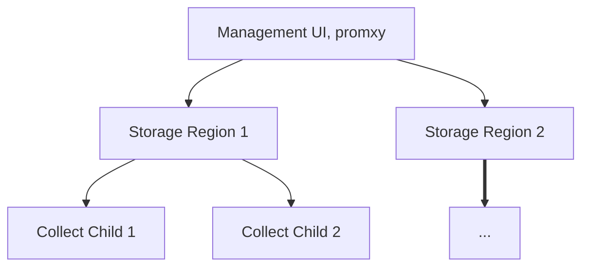
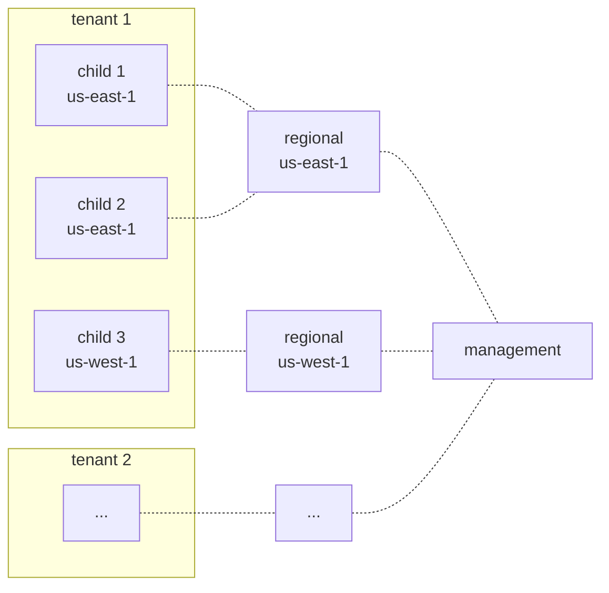

# Architecture

## High-level

From a high-level perspective, KOF consists of three layers:

* the Collection layer, where the statistics and events are gathered,
* the Regional layer, which includes storage to keep track of those statistics and events,
* and the Management layer, where you interact through the UI.


```mermaid
flowchart TD
    A[Management UI, promxy] 
    A --> C[Storage Region 1]
    A --> D[Storage Region 2]
    C --> E[Collect Child 1]
    C --> F[Collect Child 2]
    D ==> G[...]
```

## Full-Stack Observability

Main components/features of KOF:

👀 **Collectors**: OpenTelemetry, OpenCost

📦 **Storage**: VictoriaMetrics/Logs/Traces, third party

🌐 **Aggregation**: Promxy (Prometheus proxy), k0rdent/vlogxy (VictoriaLogs proxy)

📈 **Visualization**: Grafana dashboards (optional), KOF UI, Alerts, Events

🔐 **Security**: Dex SSO, Multi-Tenancy, KOF ACL

☁️  **Clouds**: AWS, Azure, OpenStack and others

✨ **Autoconfig**: MultiClusterServices, kof-operator, k0rdent/istio

## Autoconfig

Adding KOF labels to k0rdent `ClusterDeployment`:

```yaml
apiVersion: k0rdent.mirantis.com/v1beta1
kind: ClusterDeployment
metadata:
  name: $CLUSTER_NAME
  namespace: kcm-system
  labels:
    k0rdent.mirantis.com/kof-cluster-role: child  # or regional
    k0rdent.mirantis.com/kof-tenant-id: $TENANT_ID  # for child only
spec:
  config:
    region: us-east-1
    # ...
```

KOF deploys role-specific Helm charts
and connects same-region clusters automatically and securely with per-cluster credentials:


```mermaid
flowchart LR
  subgraph t2[tenant 2]
    c4[...]
  end
  subgraph t1[tenant 1]
    c1[child 1<br>us-east-1]
    c2[child 2<br>us-east-1]
    c3[child 3<br>us-west-1]
  end
  c1 -.- r[regional<br>us-east-1]
  c2 -.- r
  r -.- management
  c3 -.- r2[regional<br>us-west-1]
  r2 -.- management
  c4 -.- r3[...] -.- management
```

## Mid-level

Getting a little bit more detailed, it's important to undrestand that data flows upwards,
from observed objects to centralized dashboards on the Management layer:

<!--

To update the diagram:
* Update the indented text below.
* Copy/paste it to https://codepen.io/denis-ryzhkov/pen/ByajZeJ
* Copy the resulting HTML.
* Please preserve custom `max-width: 30em;` in the end.

<b>Management Cluster</b>
  kof umbrella chart

  kof-operators chart
    Optional grafana-operator
    opentelemetry-operator
    prometheus-operator-crds

  victoria-metrics-operator

  kof-mothership chart
    cluster-api-visualizer
    sveltos-dashboard
    dex
    {{{ docsVersionInfo.k0rdentName }}} service templates
    Optional kof-dashboards
    kof-operator
    promxy

  kof-collectors chart
    opencost
    opentelemetry-kube-stack

  kof-regional and kof-child
    MultiClusterServices

Cloud 1..N
  Region 1..M

    <b>Regional Cluster</b>
      kof-operators chart
        Optional grafana-operator
        opentelemetry-operator
        prometheus-operator-crds

      kof-storage chart
        victoria-metrics-operator
        victoria-logs-cluster
        victoria-traces-cluster
        external-dns
        dex
        Optional kof-dashboards

      kof-collectors chart
        opencost
        opentelemetry-kube-stack

      cert-manager
      ingress-nginx

    <b>Child Cluster 1</b>
      cert-manager

      kof-operators chart
        Disabled grafana-operator
        opentelemetry-operator
        prometheus-operator-crds

      kof-collectors chart
        opencost
        opentelemetry-kube-stack

      observed objects
-->

<div class="o">
  <b>Management Cluster</b>
  <div class="o">
    kof umbrella chart
  </div>
  <div class="o">
    kof-operators chart
    <div class="o">
      Optional grafana-operator
    </div>
    <div class="o">
      opentelemetry-operator
    </div>
    <div class="o">
      prometheus-operator-crds
    </div>
  </div>
  <div class="o">
    victoria-metrics-operator
  </div>
  <div class="o">
    kof-mothership chart
    <div class="o">
      cluster-api-visualizer
    </div>
    <div class="o">
      sveltos-dashboard
    </div>
    <div class="o">
      dex
    </div>
    <div class="o">
      {{{ docsVersionInfo.k0rdentName }}} service templates
    </div>
    <div class="o">
      Optional kof-dashboards
    </div>
    <div class="o">
      kof-operator
    </div>
    <div class="o">
      promxy
    </div>
  </div>
  <div class="o">
    kof-collectors chart
    <div class="o">
      opencost
    </div>
    <div class="o">
      opentelemetry-kube-stack
    </div>
  </div>
  <div class="o">
    kof-regional and kof-child
    <div class="o">
      MultiClusterServices
    </div>
  </div>
</div>
<div class="o">
  Cloud 1..N
  <div class="o">
    Region 1..M
    <div class="o">
      <b>Regional Cluster</b>
      <div class="o">
        kof-operators chart
        <div class="o">
          Optional grafana-operator
        </div>
        <div class="o">
          opentelemetry-operator
        </div>
        <div class="o">
          prometheus-operator-crds
        </div>
      </div>
      <div class="o">
        kof-storage chart
        <div class="o">
          victoria-metrics-operator
        </div>
        <div class="o">
          victoria-logs-cluster
        </div>
        <div class="o">
          external-dns
        </div>
        <div class="o">
          victoria-traces-cluster
        </div>
        <div class="o">
          dex
        </div>
        <div class="o">
          Optional kof-dashboards
        </div>
      </div>
      <div class="o">
        kof-collectors chart
        <div class="o">
          opencost
        </div>
        <div class="o">
          opentelemetry-kube-stack
        </div>
      </div>
      <div class="o">
        cert-manager
      </div>
      <div class="o">
        ingress-nginx
      </div>
    </div>
    <div class="o">
      <b>Child Cluster 1</b>
      <div class="o">
        cert-manager
      </div>
      <div class="o">
        kof-operators chart
        <div class="o">
          Disabled grafana-operator
        </div>
        <div class="o">
          opentelemetry-operator
        </div>
        <div class="o">
          prometheus-operator-crds
        </div>
      </div>
      <div class="o">
        kof-collectors chart
        <div class="o">
          opencost
        </div>
        <div class="o">
          opentelemetry-kube-stack
        </div>
      </div>
      <div class="o">
        observed objects
      </div>
    </div>
  </div>
</div>

<style>
  .o {
    margin: 0.25em 1em;
    background-color: rgba(128, 128, 128, 0.25);
    padding: 0.25em 0.5em;
    max-width: 30em;
  }
</style>

## Helm Charts

### kof umbrella chart

- This is one chart to install them all.

### kof-operators

- Optional [Grafana](https://grafana.com/) dashboards platform, managed by [grafana-operator](https://github.com/grafana/grafana-operator)
- [OpenTelemetry](https://opentelemetry.io/) [collectors](https://opentelemetry.io/docs/collector/) below, managed by [opentelemetry-operator](https://opentelemetry.io/docs/kubernetes/operator/)
- [prometheus-operator-crds](https://github.com/prometheus-community/helm-charts/tree/main/charts/prometheus-operator-crds) required to create OpenTelemetry collectors, also required to monitor [`kof-mothership`](#kof-mothership) itself

### victoria-metrics-operator

- Local [VictoriaMetrics](https://victoriametrics.com/) storage for alerting rules only, managed by [victoria-metrics-operator](https://docs.victoriametrics.com/operator/)

### kof-mothership

- [cluster-api-visualizer](https://github.com/Jont828/cluster-api-visualizer) for insight into multicluster configuration
- [Sveltos](https://projectsveltos.github.io/sveltos/) dashboard, automatic secret distribution
- [Dex](https://dexidp.io/) SSO [chart](https://github.com/dexidp/helm-charts/tree/master/charts/dex)
- [{{{ docsVersionInfo.k0rdentName }}}](https://github.com/k0rdent) service templates used by `kof-regional` and `kof-child` charts
- Optional [kof-dashboards](https://github.com/k0rdent/kof/tree/v{{{ extra.docsVersionInfo.kofVersions.kofDotVersion }}}/charts/kof-dashboards) for Grafana
- [kof-operator](https://github.com/k0rdent/kof/tree/v{{{ extra.docsVersionInfo.kofVersions.kofDotVersion }}}/kof-operator/internal/controller) (don't confuse it with the `kof-operators` chart) for auto-configuration
- [Promxy](https://github.com/jacksontj/promxy) for aggregating Prometheus metrics from regional clusters

### kof-regional

- [MultiClusterService](https://github.com/k0rdent/kof/blob/v{{{ extra.docsVersionInfo.kofVersions.kofDotVersion }}}/charts/kof-regional/templates/regional-multi-cluster-service.yaml)
  which configures and installs `kof-storage` and other charts to regional clusters

### kof-child

- [MultiClusterService](https://github.com/k0rdent/kof/blob/v{{{ extra.docsVersionInfo.kofVersions.kofDotVersion }}}/charts/kof-child/templates/child-multi-cluster-service.yaml)
  which configures and installs `kof-collectors` and other charts to child clusters

### kof-storage

- Regional [VictoriaMetrics](https://victoriametrics.com/) storage with main data, managed by [victoria-metrics-operator](https://docs.victoriametrics.com/operator/)
  - [vmauth](https://docs.victoriametrics.com/vmauth/) entrypoint proxy for VictoriaMetrics components
  - [vmcluster](https://docs.victoriametrics.com/operator/resources/vmcluster/) for high-available fault-tolerant version of VictoriaMetrics database
  - [victoria-logs-cluster](https://github.com/VictoriaMetrics/helm-charts/tree/master/charts/victoria-logs-cluster) for high-performance, cost-effective, scalable logs storage
  - [victoria-traces-cluster](https://github.com/VictoriaMetrics/helm-charts/tree/master/charts/victoria-traces-cluster) for distributed tracing storage and querying, providing a scalable backend for OpenTelemetry traces
- [external-dns](https://github.com/kubernetes-sigs/external-dns) to communicate with other clusters
- [Dex](https://dexidp.io/) SSO [chart](https://github.com/dexidp/helm-charts/tree/master/charts/dex)
- Optional [kof-dashboards](https://github.com/k0rdent/kof/tree/v{{{ extra.docsVersionInfo.kofVersions.kofDotVersion }}}/charts/kof-dashboards) for Grafana

### kof-collectors

- [opentelemetry-kube-stack](https://github.com/open-telemetry/opentelemetry-helm-charts/tree/main/charts/opentelemetry-kube-stack) for hardware, OS, and Kubernetes metrics
- [OpenCost](https://www.opencost.io/) "shines a light into the black box of Kubernetes spend"

## Deployment Scenarios

KOF supports two topologies:

### Production (Regional Clusters)
* Management-cluster telemetry is stored locally on the {{{ docsVersionInfo.k0rdentName }}} management cluster.
* Child workloads send telemetry to their regional cluster, supporting data sovereignty and isolation.

### Development / QA (Regionless)
* No regions are defined. All telemetry (management  child) is stored on the {{{ docsVersionInfo.k0rdentName }}} management cluster.

## Component Roles & Rationale

| Component | Role | Notes |
|---|---|---|
| k0rdent | Orchestration | Multi-cluster lifecycle  service templates |
| OpenTelemetry | Collection | Metrics, logs, traces; auto-instrumentation options |
| Promxy | Query Federation | Cross-cluster PromQL  alert rule evaluation at management |
| VictoriaMetrics | Metrics Storage | Scalable TSDB; selected over Prometheus for clustering  efficiency |
| VictoriaLogs | Log Storage | Scalable log TSDB with retention controls |
| VictoriaTraces | Tracing Storage | Scalable trace storage for OpenTelemetry data |
| Grafana | Visualization | Optional unified dashboards; SSO/RBAC |
| Dex | SSO | OIDC provider |
| OpenCost | FinOps | Cost allocation and efficiency ratios |

## Dex Integration

KOF uses Dex as an identity provider to enable Single Sign‑On (SSO) with OAuth2 and OIDC.

- Authentication flow: Dex issues ID tokens to dashboards and other clients after authenticating against an upstream identity provider (IdP).
- External IdP integration: Dex can delegate to providers such as Okta, Entra ID, GitHub, or LDAP.
- Group membership mapping: Dex propagates group membership claims, which KOF uses to enforce RBAC. Dashboards and KOF namespaces can be restricted based on these groups.

This model centralizes authentication, while authorization remains controlled via Kubernetes RBAC and UI roles.
