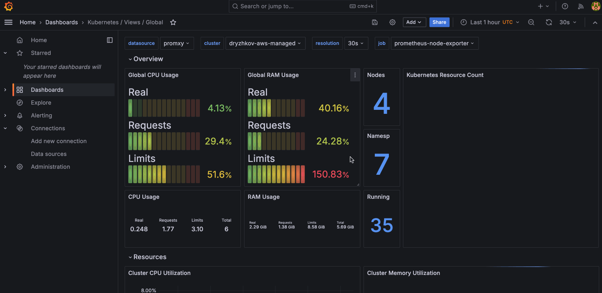

# Grafana in KOF

Grafana installation and automatic configuration are now disabled in KOF by default.

Explore the [Using KOF](kof-using.md) guide showing how to use KOF without Grafana.

## Install and enable Grafana

If you want to install Grafana manually and enable its support in KOF, apply the next steps:

* If you're using `kof-operators` chart version 1.5.0 or less, run:
    ```bash
    kubectl apply --server-side --force-conflicts -f \
    https://github.com/grafana/grafana-operator/releases/download/v5.18.0/crds.yaml
    ```
    This is required because `helm upgrade -i` does not install immutable CRDs
    when a dependency is enabled in an already installed chart.
    KOF 1.6.0 uses [auto-upgradable CRDs](https://github.com/grafana/grafana-operator/pull/2192).
* Add to the `kof-values.yaml` file:
    ```yaml
    kof-operators:
      values:
        grafana-operator:
          enabled: true
    kof-mothership:
      values:
        grafana:
          enabled: true
    ```
* Apply the `kof-values.yaml` file as described in the [Management Cluster](kof-install.md#management-cluster) section.
* Install Grafana manually, for example:
    ```bash
    kubectl apply -f - <<EOF
    apiVersion: grafana.integreatly.org/v1beta1
    kind: Grafana
    metadata:
      name: grafana-vm
      namespace: kof
      labels:
        dashboards: grafana
    spec:
      version: 10.4.18-security-01
      disableDefaultAdminSecret: true
      persistentVolumeClaim:
        spec:
          accessModes:
            - ReadWriteOnce
          resources:
            requests:
              storage: 200Mi
          # storageClassName: openebs-hostpath
      deployment:
        spec:
          template:
            spec:
              securityContext:
                fsGroup: 472
              volumes:
                - name: grafana-data
                  persistentVolumeClaim:
                    claimName: grafana-vm-pvc
              containers:
                - name: grafana
                  env:
                    - name: GF_SECURITY_ADMIN_USER
                      valueFrom:
                        secretKeyRef:
                          key: GF_SECURITY_ADMIN_USER
                          name: grafana-admin-credentials
                    - name: GF_SECURITY_ADMIN_PASSWORD
                      valueFrom:
                        secretKeyRef:
                          key: GF_SECURITY_ADMIN_PASSWORD
                          name: grafana-admin-credentials
                    - name: GF_INSTALL_PLUGINS
                      value: "victoriametrics-logs-datasource 0.21.0,victoriametrics-metrics-datasource 0.19.4"
    EOF
    ```
* You may optionally add features like `dex` and `ingress`
    from [this example](https://github.com/k0rdent/kof/blob/v{{{ extra.docsVersionInfo.kofVersions.kofDotVersion }}}/charts/kof-mothership/templates/grafana/grafana.yaml).
* Wait for Grafana installation to complete successfully:
    ```bash
    kubectl wait grafana -n kof grafana-vm \
      --for='jsonpath={.status.stage}=complete' \
      --for='jsonpath={.status.stageStatus}=success' \
      --timeout=5m
    ```
* Get access to Grafana:
    ```bash
    kubectl get secret -n kof grafana-admin-credentials -o yaml | yq '{
      "user": .data.GF_SECURITY_ADMIN_USER | @base64d,
      "pass": .data.GF_SECURITY_ADMIN_PASSWORD | @base64d
    }'

    kubectl port-forward -n kof svc/grafana-vm-service 3000:3000
    ```
* Login to [http://127.0.0.1:3000/dashboards](http://127.0.0.1:3000/dashboards) with the username/password printed above.
* Check the [Dashboards - Cluster Monitoring - Kubernetes / Views / Global](http://127.0.0.1:3000/d/k8s_views_global/kubernetes-views-global),
    it should show all clusters you collect metrics from.




## Cluster Overview

From here you can get an overview of the cluster, including:

* Health metrics
* Resource utilization
* Performance trends
* Cost analysis

## Logging Interface

The logging interface will also be available, including:

* Real-time log streaming
* Full-text search
* Log aggregation
* Alert correlation

<video controls width="1024" style="max-width: 100%">
  <source src="../../../assets/kof/victoria-logs-dashboard--2025-03-11.mp4" type="video/mp4" />
</video>

## Traces

You can view and analyze traces through Grafana Explore:

1. Open Grafana in your browser.
2. Navigate to "Explore" (compass icon in the left sidebar).
3. Select the "Jaeger" type datasource from the dropdown at the top (not "VictoriaTraces").
4. Use the query builder to search for traces by service name, operation, tags, or trace ID.

## Dashboard Categories

KOF ships with dashboards across:

* Infrastructure: Provides infrastructure-related metrics, such as kube clusters, nodes, API server, networking, storage, or GPU.
* Applications: Provides metrics for applications, such as VictoriaMetrics, VictoriaLogs, Jaeger and OpenCost.
* Service Mesh: Provides metrics for service mesh, such as Istio control-plane and traffic.
* Platform: Provides metrics for the platform itself, including KCM, Cluster API, and Sveltos.

## Dashboard Lifecycle (GitOps Workflow)

All dashboards are managed as code to keep environments consistent. To add or change a dashboard, follow these steps:

**Add a new dashboard**

1. Create a YAML file under `charts/kof-dashboards/files/dashboards/` with the new dashboard definition.
2. Commit and push the change to Git.
3. Your CI/CD pipeline applies the Helm chart to the target cluster.

**Update an existing dashboard**

1. Edit the corresponding YAML file.
2. Commit and push changes.
3. CI/CD will roll out the update automatically.

**Delete a dashboard**

1. Remove the YAML file.
2. Commit and push changes.
3. CI/CD pipeline removes the dashboard from Grafana.

> WARNING:
> Avoid editing dashboards directly in the Grafana UI. Changes will be overwritten by the next Helm release.

## Single Sign-On

Port forwarding, as described above, is a quick solution.

Single Single-On provides better experience. If you want to enable it,
please apply this advanced guide: [SSO for Grafana](https://github.com/k0rdent/kof/blob/main/docs/dex-sso.md).

See also [Multi-tenancy in KOF: Single Sign-On](kof-multi-tenancy.md#single-sign-on)
and the next sections there for additional examples.

## Uninstall Grafana

If you have Grafana [installed manually](#install-and-enable-grafana),
and now you want to uninstall it, run:

```bash
kubectl delete --wait grafana -n kof grafana-vm
```
