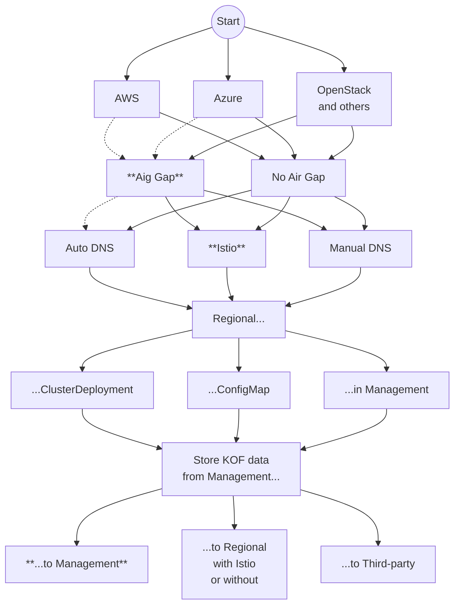

# Installing {{{ docsVersionInfo.k0rdentName }}} Observability and FinOps

## Options

KOF may be installed using different options:



Opinionated default installation we plan to simplify in the next release
is shown in **bold** style.

## Prerequisites

Before beginning KOF installation, you should have the following components in place:

* A {{{ docsVersionInfo.k0rdentName }}} management cluster - You can get instructions to create one in the [quickstart guide](../../quickstarts/quickstart-1-mgmt-node-and-cluster.md).
* You will also need your infrastructure provider credentials, such as those shown in the [guide for AWS](../../quickstarts/quickstart-2-aws.md).
    * Note that you should skip the "Create your `ClusterDeployment`" and later sections.
* Finally, select one of the options:
    * [DNS auto-config](#dns-auto-config) to automate the process for all regional clusters.
    * [Manual DNS config](./kof-verification.md#manual-dns-config) is applied later
      for each regional cluster separately and manually.
    * [Istio](#istio) service mesh for secure connectivity between clusters.
      This is the only option which does not need access to create external DNS records
      for service endpoints such as `kof.example.com`.

For for information on long-term storage planning, review the [KOF Retention](./kof-retention.md) page, which covers retention and replication strategies.

### DNS auto-config

To avoid [manual configuration of DNS records](./kof-verification.md#manual-dns-config) for service endpoints later,
you can automate the process now using [external-dns](https://kubernetes-sigs.github.io/external-dns/latest/).

#### AWS

For AWS in production, use the [Node IAM Role](https://github.com/kubernetes-sigs/external-dns/blob/master/docs/tutorials/aws.md#node-iam-role)
or [IRSA](https://github.com/kubernetes-sigs/external-dns/blob/master/docs/tutorials/aws.md#iam-roles-for-service-accounts) methods in production.

Just for the sake of this demo based on the `aws-standalone` template, however,
you can use the most straightforward (though less secure) [static credentials](https://github.com/kubernetes-sigs/external-dns/blob/master/docs/tutorials/aws.md#static-credentials) method:

1. Create an `external-dns` IAM user with [this policy](https://github.com/kubernetes-sigs/external-dns/blob/master/docs/tutorials/aws.md#iam-policy).
2. Create an access key and `external-dns-aws-credentials` file, as in:
    ```
    [default]
    aws_access_key_id = <EXAMPLE_ACCESS_KEY_ID>
    aws_secret_access_key = <EXAMPLE_SECRET_ACCESS_KEY>
    ```
3. Create the `external-dns-aws-credentials` secret in the `kof` namespace:
    ```bash
    kubectl create namespace kof
    kubectl create secret generic \
      -n kof external-dns-aws-credentials \
      --from-file external-dns-aws-credentials
    ```

#### Azure

To enable DNS auto-config on Azure, use DNS Zone Contributor.

1. Create an Azure service principal with the DNS Zone Contributor permissions. You can find an example [here](https://github.com/kubernetes-sigs/external-dns/blob/master/docs/tutorials/azure.md#creating-a-service-principal).

2. Create the `azure.json` text file containing [the service principal configuration data](https://github.com/kubernetes-sigs/external-dns/blob/master/docs/tutorials/azure.md#configuration-file):
    ```
    {
      "tenantId": "<EXAMPLE_TENANT_ID>",
      "subscriptionId": "<EXAMPLE_SUBSCRIPTION_ID>",
      "resourceGroup": "<EXAMPLE_RESOURCE_GROUP>",
      "aadClientId": "<EXAMPLE_SP_APP_ID>",
      "aadClientSecret": "<EXAMPLE_SP_PASSWORD>"
    }
    ```

3. Create the `external-dns-azure-credentials` secret in the `kof` namespace:
    ```bash
    kubectl create namespace kof
    kubectl create secret generic \
      -n kof external-dns-azure-credentials \
      --from-file azure.json
    ```
See [external-dns Azure documentation](https://github.com/kubernetes-sigs/external-dns/blob/master/docs/tutorials/azure.md) for more details.

#### OpenStack and others

Please check `external-dns` [tutorials](https://github.com/kubernetes-sigs/external-dns/tree/master/docs/tutorials)
and [new providers](https://github.com/kubernetes-sigs/external-dns?tab=readme-ov-file#new-providers)
to find instructions on how to create a secret.

For example the `external-dns-openstack-credentials` could be created
by applying the [external-dns-openstack-webhook docs](https://github.com/inovex/external-dns-openstack-webhook/blob/main/README.md#installation).

### Istio

If you've selected to skip both [DNS auto-config](#dns-auto-config) now
and [Manual DNS config](./kof-verification.md#manual-dns-config) later, you can
apply these steps to enable the [Istio](https://istio.io/) service mesh:

1. Check the overview in the [kof/docs/istio.md](https://github.com/k0rdent/kof/blob/v{{{ extra.docsVersionInfo.kofVersions.kofDotVersion }}}/docs/istio.md)
    and this video:

    <video controls width="1024" style="max-width: 100%">
      <source src="../../../assets/kof/kof-istio.mp4" type="video/mp4" />
    </video>

2. Create and label the `kof` namespace to allow Istio to inject its sidecars:
    ```bash
    kubectl create namespace kof
    kubectl label namespace kof istio-injection=enabled
    ```

3. Install the `kof-istio` chart to the management cluster:
    ```bash
    helm upgrade -i --reset-values --wait \
      --create-namespace -n istio-system kof-istio \
      oci://ghcr.io/k0rdent/kof/charts/kof-istio --version {{{ extra.docsVersionInfo.kofVersions.kofDotVersion }}}
    ```
    You may want to [customize the collectors](https://github.com/k0rdent/kof/blob/v{{{ extra.docsVersionInfo.kofVersions.kofDotVersion }}}/docs/collectors.md#example)
    by passing values to the [kof-istio-child](https://github.com/k0rdent/kof/blob/v{{{ extra.docsVersionInfo.kofVersions.kofDotVersion }}}/charts/kof-istio/templates/kof-child-cluster-profile.yaml)
    profile for all child clusters at once now,
    or for each child cluster later. You can also opt for using the default values.

> NOTICE:
> Currently the `kof-istio` chart uses `ClusterProfiles` [kof-istio-regional](https://github.com/k0rdent/kof/blob/v{{{ extra.docsVersionInfo.kofVersions.kofDotVersion }}}/charts/kof-istio/templates/kof-regional-cluster-profile.yaml)
> and [kof-istio-child](https://github.com/k0rdent/kof/blob/v{{{ extra.docsVersionInfo.kofVersions.kofDotVersion }}}/charts/kof-istio/templates/kof-child-cluster-profile.yaml).  
> In the future, however, the KOF team plans to replace them with `MultiClusterService` objects in the [kof-regional](https://github.com/k0rdent/kof/blob/v{{{ extra.docsVersionInfo.kofVersions.kofDotVersion }}}/charts/kof-regional/templates/regional-multi-cluster-service.yaml)
> and [kof-child](https://github.com/k0rdent/kof/blob/v{{{ extra.docsVersionInfo.kofVersions.kofDotVersion }}}/charts/kof-child/templates/child-multi-cluster-service.yaml) charts.
>
> If you selected the Istio option, use `kof-istio`. 
> Otherwise use `kof-regional` with `kof-child`.  Do not use all 3 charts at the same time.

## Management Cluster

To install KOF on the management cluster,
look through the default values of the [kof-mothership](https://github.com/k0rdent/kof/blob/v{{{ extra.docsVersionInfo.kofVersions.kofDotVersion }}}/charts/kof-mothership/README.md)
and [kof-operators](https://github.com/k0rdent/kof/blob/v{{{ extra.docsVersionInfo.kofVersions.kofDotVersion }}}/charts/kof-operators/values.yaml) charts,
and apply this example, or use it as a reference:

1. Install `kof-operators` as required by `kof-mothership`:
    ```bash
    helm upgrade -i --reset-values --wait \
      --create-namespace -n kof kof-operators \
      oci://ghcr.io/k0rdent/kof/charts/kof-operators --version {{{ extra.docsVersionInfo.kofVersions.kofDotVersion }}}
    ```

2. Create an empty `mothership-values.yaml` file.

    If you have not applied the [Istio](#istio) section, add to this file:
    ```yaml
    kcm:
      installTemplates: true
    ```
    This enables installation of `ServiceTemplates` such as `cert-manager` and `kof-collectors`,
    making it possible to reference them from the regional and child `MultiClusterService` objects.

3. If you want to use a [default storage class](https://kubernetes.io/docs/concepts/storage/storage-classes/#default-storageclass),
    but `kubectl get sc` shows no `(default)`, create it.
    Otherwise you can use a non-default storage class in the `mothership-values.yaml` file:
    ```yaml
    global:
      storageClass: <EXAMPLE_STORAGE_CLASS>
    ```

      If `kubectl get sc` shows nothing
      or just `kubernetes.io/no-provisioner` in the `PROVISIONER` column,
      apply [OpenEBS](https://docs.k0sproject.io/stable/examples/openebs/) or similar.

4. If you've applied the [DNS auto-config](#dns-auto-config) section,
    add its information to the `kcm:` object in the `mothership-values.yaml` file.

    For AWS, add:

    ```yaml
      kof:
        clusterProfiles:
          kof-aws-dns-secrets:
            matchLabels:
              k0rdent.mirantis.com/kof-aws-dns-secrets: "true"
            secrets:
              - external-dns-aws-credentials
    ```

    For Azure, add:

    ```yaml
      kof:
        clusterProfiles:
          kof-azure-dns-secrets:
            matchLabels:
              k0rdent.mirantis.com/kof-azure-dns-secrets: "true"
            secrets:
              - external-dns-azure-credentials
    ```

    For OpenStack, add:

    ```yaml
      kof:
        clusterProfiles:
          kof-openstack-dns-secrets:
            matchLabels:
              k0rdent.mirantis.com/kof-openstack-dns-secrets: "true"
            secrets:
              - external-dns-openstack-credentials
    ```

    This enables Sveltos to auto-distribute the DNS secret to regional clusters.

5. Examples of `ClusterDeployments` in [Regional Cluster](#regional-cluster)
    and [Child Cluster](#child-cluster) sections are both using `namespace: kcm-system`
    for a child cluster to connect to a regional cluster easily.

    If you plan to have multiple tenants/namespaces in the management cluster,
    please note they are isolated by default: a child cluster in `namespace: tenantA`
    will be able to connect to a regional cluster in `namespace: tenantA` only.

    If you want to allow a child cluster in one namespace
    to connect to a regional cluster in another namespace,
    enable the `crossNamespace` value in the `mothership-values.yaml` file:

    ```yaml
    kcm:
      kof:
        operator:
          crossNamespace: true
    ```

6. Install `kof-mothership`:
    ```bash
    helm upgrade -i --reset-values --wait -n kof kof-mothership \
      -f mothership-values.yaml \
      oci://ghcr.io/k0rdent/kof/charts/kof-mothership --version {{{ extra.docsVersionInfo.kofVersions.kofDotVersion }}}
    ```

7. If you're upgrading KOF from an earlier version, apply the [Upgrading KOF](./kof-upgrade.md) guide.

8. If you have not applied the [Istio](#istio) section:

    > NOTICE:
    > Currently the `kof-istio` chart uses `ClusterProfiles` [kof-istio-regional](https://github.com/k0rdent/kof/blob/v{{{ extra.docsVersionInfo.kofVersions.kofDotVersion }}}/charts/kof-istio/templates/kof-regional-cluster-profile.yaml)
    > and [kof-istio-child](https://github.com/k0rdent/kof/blob/v{{{ extra.docsVersionInfo.kofVersions.kofDotVersion }}}/charts/kof-istio/templates/kof-child-cluster-profile.yaml).  
    > In the future, however, the KOF team plans to replace them with `MultiClusterService` objects in the [kof-regional](https://github.com/k0rdent/kof/blob/v{{{ extra.docsVersionInfo.kofVersions.kofDotVersion }}}/charts/kof-regional/templates/regional-multi-cluster-service.yaml)
    > and [kof-child](https://github.com/k0rdent/kof/blob/v{{{ extra.docsVersionInfo.kofVersions.kofDotVersion }}}/charts/kof-child/templates/child-multi-cluster-service.yaml) charts.
    >
    > If you selected the Istio option, use `kof-istio`. 
    > Otherwise use `kof-regional` with `kof-child`.  Do not use all 3 charts at the same time.

    * Wait until the value of `VALID` changes to `true` for all `ServiceTemplate` objects:
        ```bash
        kubectl get svctmpl -A
        ```
    * Look through the `MultiClusterService` objects in the [kof-regional](https://github.com/k0rdent/kof/blob/v{{{ extra.docsVersionInfo.kofVersions.kofDotVersion }}}/charts/kof-regional/templates/regional-multi-cluster-service.yaml)
        and [kof-child](https://github.com/k0rdent/kof/blob/v{{{ extra.docsVersionInfo.kofVersions.kofDotVersion }}}/charts/kof-child/templates/child-multi-cluster-service.yaml) charts.
    * If your regional clusters already have `ingress-nginx` and `cert-manager` services,
        you can ask the `kof-regional` chart to not install them by setting Helm values
        `ingress-nginx.enabled` and `cert-manager.enabled` to `false`.
    * You may want to [customize collectors](https://github.com/k0rdent/kof/blob/v{{{ extra.docsVersionInfo.kofVersions.kofDotVersion }}}/docs/collectors.md#example)
        for all child clusters at once now, or for each child cluster later, or just use the default values.
    * If all your regional clusters will use OpenStack,
        you may set the OpenStack-specific values described in step 10 of the [Regional Cluster](#regional-cluster) section
        as a values file with `storage:` key passed to `kof-regional` chart here.
    * Install these charts into the management cluster with default or custom values:
        ```bash
        helm upgrade -i --reset-values --wait -n kof kof-regional \
          oci://ghcr.io/k0rdent/kof/charts/kof-regional --version {{{ extra.docsVersionInfo.kofVersions.kofDotVersion }}}

        helm upgrade -i --reset-values --wait -n kof kof-child \
          oci://ghcr.io/k0rdent/kof/charts/kof-child --version {{{ extra.docsVersionInfo.kofVersions.kofDotVersion }}}
        ```

9. Wait for all pods to show that they're `Running`:
    ```bash
    kubectl get pod -n kof
    ```

10. Check options to store metrics of the management cluster in the [Storing KOF data](./kof-storing.md) guide.

## Regional Cluster

To install KOF on the regional cluster,
look through the default values of the [kof-storage](https://github.com/k0rdent/kof/blob/v{{{ extra.docsVersionInfo.kofVersions.kofDotVersion }}}/charts/kof-storage/values.yaml) chart,
and apply this example for AWS, or use it as a reference:

1. Set your KOF variables using your own values:
    ```bash
    REGION=us-east-2
    REGIONAL_CLUSTER_NAME=aws-$REGION
    ADMIN_EMAIL=$(git config user.email)
    echo "$REGION, $REGIONAL_CLUSTER_NAME, $ADMIN_EMAIL"
    ```

    If you have not applied the [Istio](#istio) section,
    set the `REGIONAL_DOMAIN` too, using your own domain:
    ```bash
    REGIONAL_DOMAIN=$REGIONAL_CLUSTER_NAME.kof.example.com
    echo "$REGIONAL_DOMAIN"
    ```

2. Use the up-to-date `ClusterTemplate`, as in:
    ```bash
    kubectl get clustertemplate -n kcm-system | grep aws
    TEMPLATE=aws-standalone-cp-{{{ extra.docsVersionInfo.providerVersions.dashVersions.awsStandaloneCpCluster }}}
    ```

3. Compose the regional `ClusterDeployment`:

    For AWS:

    ```bash
    cat >regional-cluster.yaml <<EOF
    apiVersion: k0rdent.mirantis.com/v1beta1
    kind: ClusterDeployment
    metadata:
      name: $REGIONAL_CLUSTER_NAME
      namespace: kcm-system
      labels:
        k0rdent.mirantis.com/kof-storage-secrets: "true"
        k0rdent.mirantis.com/kof-cluster-role: regional
    spec:
      template: $TEMPLATE
      credential: aws-cluster-identity-cred
      config:
        clusterIdentity:
          name: aws-cluster-identity
          namespace: kcm-system
        clusterAnnotations:
          k0rdent.mirantis.com/kof-regional-domain: $REGIONAL_DOMAIN
          k0rdent.mirantis.com/kof-cert-email: $ADMIN_EMAIL
        region: $REGION
        controlPlaneNumber: 1
        controlPlane:
          instanceType: t3.large
        workersNumber: 3
        worker:
          instanceType: t3.xlarge
    EOF
    ```

    For Azure:

    ```bash
    AZURE_SUBSCRIPTION_ID=$(az account show --query id -o tsv)
    echo "AZURE_SUBSCRIPTION_ID=$AZURE_SUBSCRIPTION_ID"

    cat >regional-cluster.yaml <<EOF
    apiVersion: k0rdent.mirantis.com/v1beta1
    kind: ClusterDeployment
    metadata:
      name: $REGIONAL_CLUSTER_NAME
      namespace: kcm-system
      labels:
        k0rdent.mirantis.com/kof-storage-secrets: "true"
        k0rdent.mirantis.com/kof-cluster-role: regional
    spec:
      template: $TEMPLATE
      credential: azure-cluster-identity-cred
      config:
        clusterIdentity:
          name: azure-cluster-identity
          namespace: kcm-system
        clusterAnnotations:
          k0rdent.mirantis.com/kof-regional-domain: $REGIONAL_DOMAIN
          k0rdent.mirantis.com/kof-cert-email: $ADMIN_EMAIL
        subscriptionID: $AZURE_SUBSCRIPTION_ID
        location: $REGION
        controlPlaneNumber: 1
        controlPlane:
          vmSize: Standard_A4_v2
        workersNumber: 3
        worker:
          vmSize: Standard_A4_v2
    EOF
    ```

4. If you've applied the [DNS auto-config](#dns-auto-config) section,
    add it to the `.metadata.labels` in the `regional-cluster.yaml` file.

    For AWS, add:

    ```yaml
    k0rdent.mirantis.com/kof-aws-dns-secrets: "true"
    ```

    For Azure, add:

    ```yaml
    k0rdent.mirantis.com/kof-azure-dns-secrets: "true"
    ```

    For OpenStack, add:

    ```yaml
    k0rdent.mirantis.com/kof-openstack-dns-secrets: "true"
    ```

5. If you've applied the [Istio](#istio) section, update the `regional-cluster.yaml` file:

    * Replace this line:
      ```yaml
      k0rdent.mirantis.com/kof-storage-secrets: "true"
      ```
      with:
      ```yaml
      k0rdent.mirantis.com/istio-role: member
      k0rdent.mirantis.com/istio-gateway: "true"
      ```
      Note that `child` is not a typo
      and the `kof-` prefix is not missing in `istio-role`.
      These values make your configuration compatible with possible migration of Istio support
      from KOF to the upstream k0rdent,
      where `child` is a generic term described in the [Cluster Deployments](../../concepts/k0rdent-architecture.md/#cluster-deployments) concept.

    * Delete these lines:
      ```yaml
      k0rdent.mirantis.com/kof-regional-domain: $REGIONAL_DOMAIN
      k0rdent.mirantis.com/kof-cert-email: $ADMIN_EMAIL
      ```

6. This `ClusterDeployment` uses propagation of its `.metadata.labels`
    to the resulting `Cluster` because there are no `.spec.config.clusterLabels` here.
    If you add them, please copy `.metadata.labels` as well.

7. The `aws-standalone-cp` template provides the [default storage class](https://kubernetes.io/docs/concepts/storage/storage-classes/#default-storageclass)
    `ebs-csi-default-sc` for AWS. The [k0rdent quickstart guide](../../quickstarts/quickstart-2-azure.md#create-the-configmap-resource-template-object)
    provides the default storage class `managed-csi` for Azure.
    If you want to use a non-default storage class,
    add it to the `regional-cluster.yaml` file in the `.spec.config.clusterAnnotations`:
    ```yaml
    k0rdent.mirantis.com/kof-storage-class: <EXAMPLE_STORAGE_CLASS>
    ```

8. The `kof-operator` creates and configures `PromxyServerGroup` and `GrafanaDatasource` [automatically](https://github.com/k0rdent/kof/blob/v{{{ extra.docsVersionInfo.kofVersions.kofDotVersion }}}/kof-operator/internal/controller/clusterdeployment_kof_cluster_role.go).
    It uses the endpoints listed below by default.
    If you want to disable the built-in metrics, logs, and traces to use your own existing instances instead,
    add custom endpoints to the `regional-cluster.yaml` file in the `.spec.config.clusterAnnotations`:
    ```yaml
    k0rdent.mirantis.com/kof-write-metrics-endpoint: https://vmauth.$REGIONAL_DOMAIN/vm/insert/0/prometheus/api/v1/write
    k0rdent.mirantis.com/kof-read-metrics-endpoint: https://vmauth.$REGIONAL_DOMAIN/vm/select/0/prometheus
    k0rdent.mirantis.com/kof-write-logs-endpoint: https://vmauth.$REGIONAL_DOMAIN/vli/insert/opentelemetry/v1/logs
    k0rdent.mirantis.com/kof-read-logs-endpoint: https://vmauth.$REGIONAL_DOMAIN/vls
    k0rdent.mirantis.com/kof-write-traces-endpoint: https://jaeger.$REGIONAL_DOMAIN/collector
    ```

    If you've applied the [Istio](#istio) section, default endpoints are:
    ```yaml
    k0rdent.mirantis.com/kof-write-metrics-endpoint: http://$REGIONAL_CLUSTER_NAME-vminsert:8480/insert/0/prometheus/api/v1/write
    k0rdent.mirantis.com/kof-read-metrics-endpoint: http://$REGIONAL_CLUSTER_NAME-vmselect:8481/select/0/prometheus
    k0rdent.mirantis.com/kof-write-logs-endpoint: http://$REGIONAL_CLUSTER_NAME-logs-insert:9481/insert/opentelemetry/v1/logs
    k0rdent.mirantis.com/kof-read-logs-endpoint: http://$REGIONAL_CLUSTER_NAME-logs-select:9471
    k0rdent.mirantis.com/kof-write-traces-endpoint: http://$REGIONAL_CLUSTER_NAME-jaeger-collector:4318
    ```

    If you want to skip creation of the regional cluster completely,
    but still let child clusters discover your custom endpoints,
    you may create a regional `ConfigMap` instead of a regional `ClusterDeployment`:
    ```bash
    cat >regional-configmap.yaml <<EOF
    apiVersion: v1
    kind: ConfigMap
    metadata:
      name: $REGIONAL_CLUSTER_NAME
      namespace: kcm-system
      labels:
        k0rdent.mirantis.com/kof-cluster-role: regional
    data:
      regional_cluster_name: $REGIONAL_CLUSTER_NAME
      regional_cluster_namespace: kcm-system
      regional_cluster_cloud: aws
      aws_region: $REGION
      azure_location: ""
      openstack_region: ""
      vsphere_datacenter: ""
      istio_role: ""
      kof_http_config: ""
      write_metrics_endpoint: https://vmauth.$REGIONAL_DOMAIN/vm/insert/0/prometheus/api/v1/write
      read_metrics_endpoint: https://vmauth.$REGIONAL_DOMAIN/vm/select/0/prometheus
      write_logs_endpoint: https://vmauth.$REGIONAL_DOMAIN/vli/insert/opentelemetry/v1/logs
      read_logs_endpoint: https://vmauth.$REGIONAL_DOMAIN/vls
      write_traces_endpoint: https://jaeger.$REGIONAL_DOMAIN/collector
    EOF

    cat regional-configmap.yaml
    kubectl apply -f regional-configmap.yaml
    ```

    Note that a similar `ConfigMap` is generated automatically from a regional `ClusterDeployment` too.

9. If you need a custom http client configuration for `PromxyServerGroup` and `GrafanaDatasource`,
    add it to the `regional-cluster.yaml` file in the `.metadata.annotations`. For example:
    ```yaml
    k0rdent.mirantis.com/kof-http-config: '{"dial_timeout": "10s", "tls_config": {"insecure_skip_verify": true}}'
    ```

10. Either `MultiClusterService` named [kof-regional-cluster](https://github.com/k0rdent/kof/blob/v{{{ extra.docsVersionInfo.kofVersions.kofDotVersion }}}/charts/kof-regional/templates/regional-multi-cluster-service.yaml)
    or `ClusterProfiles` named [kof-istio-regional](https://github.com/k0rdent/kof/blob/v{{{ extra.docsVersionInfo.kofVersions.kofDotVersion }}}/charts/kof-istio/templates/kof-regional-cluster-profile.yaml)
    and [kof-istio-network](https://github.com/k0rdent/kof/blob/v{{{ extra.docsVersionInfo.kofVersions.kofDotVersion }}}/charts/kof-istio/templates/child-cluster-profiles.yaml)
    configure and install `cert-manager`, `ingress-nginx`, `istio/gateway`, `kof-istio`, `kof-operators`, `kof-storage`, and `kof-collectors` charts automatically.

    To pass any custom [values](https://github.com/k0rdent/kof/blob/v{{{ extra.docsVersionInfo.kofVersions.kofDotVersion }}}/charts/kof-storage/values.yaml) to the `kof-storage` chart
    or its subcharts, such as [victoria-logs-cluster](https://docs.victoriametrics.com/helm/victorialogs-cluster/#parameters),
    add them to the `regional-cluster.yaml` file in the `.spec.config.clusterAnnotations`. For example:
    ```yaml
    k0rdent.mirantis.com/kof-storage-values: |
      victoria-logs-cluster:
        vlinsert:
          replicaCount: 2
    ```

    For OpenStack, add:
    ```yaml
    k0rdent.mirantis.com/kof-storage-values: |
      external-dns:
        provider:
          name: webhook
          webhook:
            image:
              repository: ghcr.io/inovex/external-dns-openstack-webhook
              tag: 1.1.0
            extraVolumeMounts:
              - name: oscloudsyaml
                mountPath: /etc/openstack/
        extraVolumeMounts: null
        extraVolumes:
          - name: oscloudsyaml
            secret:
              secretName: external-dns-openstack-credentials
    ```

11. Verify and apply the Regional `ClusterDeployment`:
    ```bash
    cat regional-cluster.yaml

    kubectl apply -f regional-cluster.yaml
    ```

12. Watch how the cluster is deployed until all values of `READY` are `True`:
    ```bash
    clusterctl describe cluster -n kcm-system $REGIONAL_CLUSTER_NAME \
      --show-conditions all
    ```

## Child Cluster

To install KOF on the actual cluster to be monitored,
look through the default values of the [kof-operators](https://github.com/k0rdent/kof/blob/v{{{ extra.docsVersionInfo.kofVersions.kofDotVersion }}}/charts/kof-operators/values.yaml)
and [kof-collectors](https://github.com/k0rdent/kof/blob/v{{{ extra.docsVersionInfo.kofVersions.kofDotVersion }}}/charts/kof-collectors/values.yaml) charts,
and apply this example for AWS, or use it as a reference:

1. Ensure you still have the variables set in the [Regional Cluster](#regional-cluster) section,
    and set your own value for the `CHILD_CLUSTER_NAME` variable:
    ```bash
    CHILD_CLUSTER_NAME=$REGIONAL_CLUSTER_NAME-child1
    echo "$CHILD_CLUSTER_NAME"
    ```

2. Use the up-to-date `ClusterTemplate`, as in:
    ```bash
    kubectl get clustertemplate -n kcm-system | grep aws
    TEMPLATE=aws-standalone-cp-{{{ extra.docsVersionInfo.providerVersions.dashVersions.awsStandaloneCpCluster }}}
    ```

3. Compose the child `ClusterDeployment`:

    For AWS:

    ```bash
    cat >child-cluster.yaml <<EOF
    apiVersion: k0rdent.mirantis.com/v1beta1
    kind: ClusterDeployment
    metadata:
      name: $CHILD_CLUSTER_NAME
      namespace: kcm-system
      labels:
        k0rdent.mirantis.com/kof-storage-secrets: "true"
        k0rdent.mirantis.com/kof-cluster-role: child
    spec:
      template: $TEMPLATE
      credential: aws-cluster-identity-cred
      config:
        clusterIdentity:
          name: aws-cluster-identity
          namespace: kcm-system
        region: $REGION
        controlPlaneNumber: 1
        controlPlane:
          instanceType: t3.large
        workersNumber: 3
        worker:
          instanceType: t3.medium
    EOF
    ```

    For Azure:

    ```bash
    AZURE_SUBSCRIPTION_ID=$(az account show --query id -o tsv)
    echo "AZURE_SUBSCRIPTION_ID=$AZURE_SUBSCRIPTION_ID"

    cat >child-cluster.yaml <<EOF
    apiVersion: k0rdent.mirantis.com/v1beta1
    kind: ClusterDeployment
    metadata:
      name: $CHILD_CLUSTER_NAME
      namespace: kcm-system
      labels:
        k0rdent.mirantis.com/kof-storage-secrets: "true"
        k0rdent.mirantis.com/kof-cluster-role: child
    spec:
      template: $TEMPLATE
      credential: azure-cluster-identity-cred
      config:
        clusterIdentity:
          name: azure-cluster-identity
          namespace: kcm-system
        subscriptionID: $AZURE_SUBSCRIPTION_ID
        location: $REGION
        controlPlaneNumber: 1
        controlPlane:
          vmSize: Standard_A4_v2
        workersNumber: 3
        worker:
          vmSize: Standard_A4_v2
    EOF
    ```

4. If you've applied the [Istio](#istio) section, update the `child-cluster.yaml` file:

    replace this line:
    ```yaml
    k0rdent.mirantis.com/kof-storage-secrets: "true"
    ```
    with this line:
    ```yaml
    k0rdent.mirantis.com/istio-role: child
    ```

    > NOTE:
    > There is no need to create a gateway in the child cluster
    > using the `k0rdent.mirantis.com/istio-gateway: "true"` label.
    > The child cluster uses the gateway in the regional cluster to [store KOF data](./kof-storing.md).

5. This `ClusterDeployment` uses propagation of its `.metadata.labels`
    to the resulting `Cluster` because there are no `.spec.config.clusterLabels` here.
    If you add them, please copy `.metadata.labels` as well.

6. The `kof-operator` [discovers](https://github.com/k0rdent/kof/blob/v{{{ extra.docsVersionInfo.kofVersions.kofDotVersion }}}/kof-operator/internal/controller/clusterdeployment_kof_cluster_role.go)
    the regional cluster by the location of the child cluster.
    If you have more than one regional cluster in the same AWS region / Azure location / etc.,
    and you want to connect the child cluster to specific regional cluster,
    add this regional cluster name to the `child-cluster.yaml` file in the `.metadata.labels`:
    ```yaml
    k0rdent.mirantis.com/kof-regional-cluster-name: $REGIONAL_CLUSTER_NAME
    ```

    If you've enabled the `crossNamespace` value, specify the namespace too, for example:
    ```yaml
    k0rdent.mirantis.com/kof-regional-cluster-namespace: kcm-system
    ```

7. Either `MultiClusterService` named [kof-child-cluster](https://github.com/k0rdent/kof/blob/v{{{ extra.docsVersionInfo.kofVersions.kofDotVersion }}}/charts/kof-child/templates/child-multi-cluster-service.yaml)
    or `ClusterProfiles` named [kof-istio-child](https://github.com/k0rdent/kof/blob/v{{{ extra.docsVersionInfo.kofVersions.kofDotVersion }}}/charts/kof-istio/templates/kof-child-cluster-profile.yaml)
    and [kof-istio-network](https://github.com/k0rdent/kof/blob/v{{{ extra.docsVersionInfo.kofVersions.kofDotVersion }}}/charts/kof-istio/templates/child-cluster-profiles.yaml)
    configure and install `cert-manager`, `kof-istio`, `kof-operators`, and `kof-collectors` charts automatically.

    To pass any custom [values](https://github.com/k0rdent/kof/blob/v{{{ extra.docsVersionInfo.kofVersions.kofDotVersion }}}/charts/kof-collectors/values.yaml) to the `kof-collectors` chart
    or its subcharts, such as [opencost](https://github.com/opencost/opencost-helm-chart/blob/main/charts/opencost/README.md#values),
    add them to the `child-cluster.yaml` file in the `.spec.config`. For example:
    ```yaml
    clusterAnnotations:
      k0rdent.mirantis.com/kof-collectors-values: |
        opencost:
          opencost:
            exporter:
              replicas: 2
    ```
    Note: the first `opencost` key is to reference the subchart,
    and the second `opencost` key is part of its [values](https://github.com/opencost/opencost-helm-chart/blob/main/charts/opencost/README.md#values).

8. Verify and apply the `ClusterDeployment`:
    ```bash
    cat child-cluster.yaml

    kubectl apply -f child-cluster.yaml
    ```

9. Watch while the cluster is deployed until all values of `READY` are `True`:
    ```bash
    clusterctl describe cluster -n kcm-system $CHILD_CLUSTER_NAME \
      --show-conditions all
    ```
    
Now that you have installed KOF, please [verify it](./kof-verification.md).
