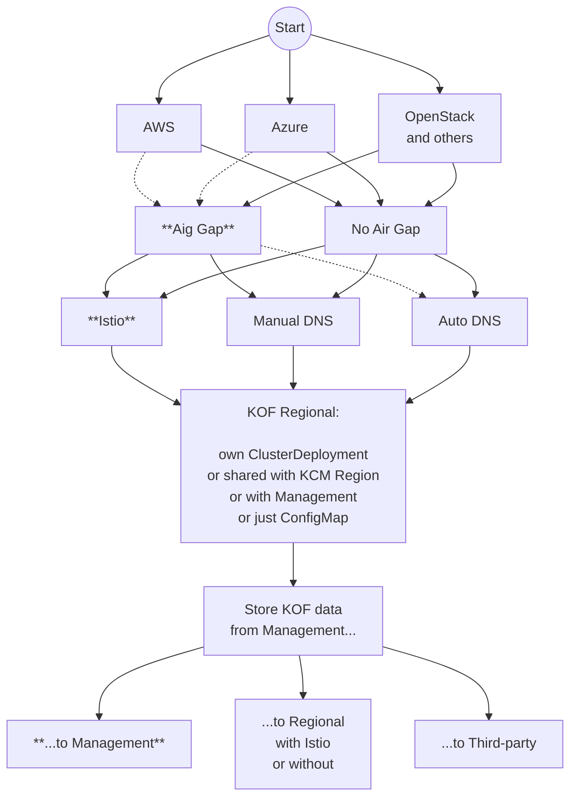

# Installing {{{ docsVersionInfo.k0rdentName }}} Observability and FinOps

## Options

KOF may be installed using different options:


```mermaid
flowchart TD
    S((Start))
    S --> AWS[AWS]
    S --> AZ[Azure]
    S --> OS[OpenStack<br>and others]
    AWS -.-> AG[**Aig Gap**]
    AZ -.-> AG
    OS --> AG
    AWS --> NAG[No Air Gap]
    AZ --> NAG
    OS --> NAG
    AG --> I[**Istio**]
    AG --> MD[Manual DNS]
    AG -.-> AD[Auto DNS]
    NAG --> I
    NAG --> MD
    NAG --> AD
    I --> R[KOF Regional:<br><br>own ClusterDeployment<br>or shared with KCM Region<br>or with Management<br>or just ConfigMap]
    MD --> R
    AD --> R
    R --> M2[Store KOF data<br>from Management...]
    M2 --> M2M[**...to Management**]
    M2 --> M2R[...to Regional<br>with Istio<br>or without]
    M2 --> M2TP[...to Third-party]
```

Opinionated default installation we plan to simplify in the next release
is shown in **bold** style.

## Prerequisites

Before beginning KOF installation, you should have the following components in place:

* A {{{ docsVersionInfo.k0rdentName }}} management cluster - You can get instructions to create one in the [quickstart guide](../../quickstarts/quickstart-1-mgmt-node-and-cluster.md).
* You will also need your infrastructure provider credentials, such as those shown in the [guide for AWS](../../quickstarts/quickstart-2-aws.md).
    * Note that you should skip the "Create your `ClusterDeployment`" and later sections.
* Finally, select one of the options:
    * [DNS auto-config](#dns-auto-config) to automate the process for all regional clusters.
    * [Manual DNS config](./kof-verification.md#manual-dns-config) is applied later
      for each regional cluster separately and manually.
    * [Istio](#istio) service mesh for secure connectivity between clusters.
      This is the only option which does not need access to create external DNS records
      for service endpoints such as `kof.example.com`.

For for information on long-term storage planning, review the [KOF Retention](./kof-retention.md) page, which covers retention and replication strategies.





### DNS auto-config

To avoid [manual configuration of DNS records](./kof-verification.md#manual-dns-config) for service endpoints later,
you can automate the process now using [external-dns](https://kubernetes-sigs.github.io/external-dns/latest/).
Examples by cloud provider:

??? note "AWS"

    For AWS in production, use the [Node IAM Role](https://github.com/kubernetes-sigs/external-dns/blob/master/docs/tutorials/aws.md#node-iam-role)
    or [IRSA](https://github.com/kubernetes-sigs/external-dns/blob/master/docs/tutorials/aws.md#iam-roles-for-service-accounts) methods in production.

    Just for the sake of this demo based on the `aws-standalone` template, however,
    you can use the most straightforward (though less secure) [static credentials](https://github.com/kubernetes-sigs/external-dns/blob/master/docs/tutorials/aws.md#static-credentials) method:

    1. Create an `external-dns` IAM user with [this policy](https://github.com/kubernetes-sigs/external-dns/blob/master/docs/tutorials/aws.md#iam-policy).
    2. Create an access key and `external-dns-aws-credentials` file, as in:
        ```
        [default]
        aws_access_key_id = <EXAMPLE_ACCESS_KEY_ID>
        aws_secret_access_key = <EXAMPLE_SECRET_ACCESS_KEY>
        ```
    3. Create the `external-dns-aws-credentials` secret in the `kof` namespace:
        ```bash
        kubectl create namespace kof
        kubectl create secret generic \
          -n kof external-dns-aws-credentials \
          --from-file external-dns-aws-credentials
        ```

??? note "Azure"

    To enable DNS auto-config on Azure, use DNS Zone Contributor.

    1. Create an Azure service principal with the DNS Zone Contributor permissions. You can find an example [here](https://github.com/kubernetes-sigs/external-dns/blob/master/docs/tutorials/azure.md#creating-a-service-principal).

    2. Create the `azure.json` text file containing [the service principal configuration data](https://github.com/kubernetes-sigs/external-dns/blob/master/docs/tutorials/azure.md#configuration-file):
        ```
        {
          "tenantId": "<EXAMPLE_TENANT_ID>",
          "subscriptionId": "<EXAMPLE_SUBSCRIPTION_ID>",
          "resourceGroup": "<EXAMPLE_RESOURCE_GROUP>",
          "aadClientId": "<EXAMPLE_SP_APP_ID>",
          "aadClientSecret": "<EXAMPLE_SP_PASSWORD>"
        }
        ```

    3. Create the `external-dns-azure-credentials` secret in the `kof` namespace:
        ```bash
        kubectl create namespace kof
        kubectl create secret generic \
          -n kof external-dns-azure-credentials \
          --from-file azure.json
        ```
    See [external-dns Azure documentation](https://github.com/kubernetes-sigs/external-dns/blob/master/docs/tutorials/azure.md) for more details.

??? note "OpenStack and others"

    Please check `external-dns` [tutorials](https://github.com/kubernetes-sigs/external-dns/tree/master/docs/tutorials)
    and [new providers](https://github.com/kubernetes-sigs/external-dns?tab=readme-ov-file#new-providers)
    to find instructions on how to create a secret.

    For example the `external-dns-openstack-credentials` could be created
    by applying the [external-dns-openstack-webhook docs](https://github.com/inovex/external-dns-openstack-webhook/blob/main/README.md#installation).

### Istio

If you've selected to skip both [DNS auto-config](#dns-auto-config) now and [Manual DNS config](./kof-verification.md#manual-dns-config) later, you can apply these steps to enable the [Istio](https://istio.io/) service mesh:

??? note "Istio"

    1. Check the overview in the [k0rdent/istio repository](https://github.com/k0rdent/istio) and this video:

        <video controls width="1024" style="max-width: 100%">
          <source src="../../../assets/kof/kof-istio.mp4" type="video/mp4" />
        </video>

    2. Create and label the `kof` namespace to allow Istio to inject its sidecars:

        ```bash
        kubectl create namespace kof
        kubectl label namespace kof istio-injection=enabled
        ```

    3. Install the `k0rdent/istio` charts to the management cluster:

    

        Please use helm v3 until we fix [k0rdent/istio issue #40](https://github.com/k0rdent/istio/issues/40)
        leading to `UPGRADE FAILED: conflict occurred...` when using helm v4.

### Grafana

* Grafana installation and automatic configuration are now disabled in KOF by default.
* Review the [Using KOF](kof-using.md) and [Grafana in KOF](kof-grafana.md) guides to make a decision.

## Management Cluster

To install KOF on the management cluster,
look through the default values of the [kof](https://github.com/k0rdent/kof/blob/v{{{ extra.docsVersionInfo.kofVersions.kofDotVersion }}}/charts/kof/README.md) chart,
and apply this example, or use it as a reference:

1. Create an empty `kof-values.yaml` file.

2. Check requirements to the [storage class](./kof-storing.md#storage-class-requirements-for-victoriametrics-cluster).

    If you want to use a [default storage class](https://kubernetes.io/docs/concepts/storage/storage-classes/#default-storageclass),
    but `kubectl get sc` shows no `(default)`, create it.
    Otherwise you can use a non-default storage class in the `kof-values.yaml` file:

    ??? note "Non-default storage class"

        ```yaml
        kof-mothership:
          values:
            global:
              storageClass: <EXAMPLE_STORAGE_CLASS>
        ```

        If you plan to enable `kof-storage` component (for local/single-cluster deployments), also set:
        ```yaml
        kof-storage:
          values:
            global:
              storageClass: <EXAMPLE_STORAGE_CLASS>
        ```

    If `kubectl get sc` shows nothing
    or just `kubernetes.io/no-provisioner` in the `PROVISIONER` column,
    apply [OpenEBS](https://docs.k0sproject.io/stable/examples/openebs/) or similar.

3. If you've applied the [DNS auto-config](#dns-auto-config) section,
    add the information about `external-dns` credentials to the `kof-values.yaml` file.
    Examples by cloud provider:

    ??? note "AWS"

        ```yaml
        kof-mothership:
          values:
            kcm:
              kof:
                mcs:
                  kof-aws-dns-secrets:
                    matchLabels:
                      k0rdent.mirantis.com/kof-aws-dns-secrets: "true"
                    secrets:
                      - external-dns-aws-credentials
        ```

    ??? note "Azure"

        ```yaml
        kof-mothership:
          values:
            kcm:
              kof:
                mcs:
                  kof-azure-dns-secrets:
                    matchLabels:
                      k0rdent.mirantis.com/kof-azure-dns-secrets: "true"
                    secrets:
                      - external-dns-azure-credentials
        ```

    ??? note "OpenStack"

        ```yaml
        kof-mothership:
          values:
            kcm:
              kof:
                mcs:
                  kof-openstack-dns-secrets:
                    matchLabels:
                      k0rdent.mirantis.com/kof-openstack-dns-secrets: "true"
                    secrets:
                      - external-dns-openstack-credentials
        ```

    This enables auto-distribution of the DNS secret to regional clusters.

4. Examples of `ClusterDeployments` in [Regional Cluster](#regional-cluster)
    and [Child Cluster](#child-cluster) sections are both using `namespace: kcm-system`
    for a child cluster to connect to a regional cluster easily.

    If you plan to have multiple tenants/namespaces in the management cluster,
    please note they are isolated by default: a child cluster in `namespace: tenantA`
    will be able to connect to a regional cluster in `namespace: tenantA` only.

    If you want to allow a child cluster in one namespace
    to connect to a regional cluster in another namespace,
    enable the `crossNamespace` value in the `kof-values.yaml` file:

    ??? note "crossNamespace"

        ```yaml
        kof-mothership:
          values:
            kcm:
              kof:
                operator:
                  crossNamespace: true
        ```

5. Check the high-level [default values](https://github.com/k0rdent/kof/blob/v{{{ extra.docsVersionInfo.kofVersions.kofDotVersion }}}/charts/kof/values.yaml)
    of the `kof` umbrella chart, and more detailed default values of other [charts](https://github.com/k0rdent/kof/tree/v{{{ extra.docsVersionInfo.kofVersions.kofDotVersion }}}/charts),
    to customize your `kof-values.yaml` file where needed, for example:

    ??? note "If your regional clusters already have `cert-manager` and `ingress-nginx`, disable them in KOF:"

        ```yaml
        kof-regional:
          values:
            cert-manager:
              enabled: false
            ingress-nginx:
              enabled: false
        ```

    ??? note "To customize storage for all regional clusters at once now:"

        ```yaml
        kof-regional:
          values:
            storage:
              # ...
        ```

        For example, if all your regional clusters will use OpenStack,
        you may set the OpenStack-specific values described in step 10 of the [Regional Cluster](#regional-cluster) section
        under the `storage:` key here.

    ??? note "To customize collectors for all child clusters at once now:"

        ```yaml
        kof-child:
          values:
            collectors:
              collectors:
                # ...
        ```

        Note: the first `collectors` key is to reference the subchart,
        and the second `collectors` key is part of its [values](https://github.com/k0rdent/kof/blob/v{{{ extra.docsVersionInfo.kofVersions.kofDotVersion }}}/charts/kof-collectors/values.yaml).

        Check the [examples of OpenTelemetry collectors custom configuration](https://github.com/k0rdent/kof/blob/v{{{ extra.docsVersionInfo.kofVersions.kofDotVersion }}}/docs/collectors.md#example).

6. If you're upgrading KOF from an earlier version, check the [Upgrading KOF](./kof-upgrade.md) guide.

7. Install the KOF umbrella chart, which orchestrates the installation of
    operators, mothership, and shared config for all regional and child clusters:



    The chart uses FluxCD to manage sequential deployment of all KOF components.
    
    If helm v4 `failed to call webhook`, apply the workaround from [k0rdent/kof issue #715](https://github.com/k0rdent/kof/issues/715).

8. Wait for all HelmReleases to be ready:
    ```bash
    kubectl wait --for=condition=Ready helmreleases --all -n kof --timeout=10m
    kubectl get helmreleases -n kof
    ```


9. Wait for all pods to show that they're `Running`:
    ```bash
    kubectl get pod -n kof
    ```

10. Check options to store metrics of the management cluster in the [Storing KOF data](./kof-storing.md) guide.

## Regional Cluster

> NOTE:
> To use the new [KCM Regional Clusters](../regional-clusters/index.md) with KOF, please apply the [KCM Region With KOF](kof-kcm-region.md) guide on top of the steps below.

To install KOF on the regional cluster,
apply this example for AWS, or use it as a reference:

1. Set your KOF variables using your own values:
    ```bash
    REGION=us-east-2
    REGIONAL_CLUSTER_NAME=aws-$REGION
    ADMIN_EMAIL=$(git config user.email)
    echo "$REGION, $REGIONAL_CLUSTER_NAME, $ADMIN_EMAIL"
    ```

    If you have not applied the [Istio](#istio) section,
    set the `REGIONAL_DOMAIN` too, using your own domain:
    ```bash
    REGIONAL_DOMAIN=$REGIONAL_CLUSTER_NAME.kof.example.com
    echo "$REGIONAL_DOMAIN"
    ```

2. Use the up-to-date `ClusterTemplate`, as in:
    ```bash
    kubectl get clustertemplate -n kcm-system | grep aws
    TEMPLATE=aws-standalone-cp-{{{ extra.docsVersionInfo.providerVersions.dashVersions.awsStandaloneCpCluster }}}
    ```

3. Compose the regional `ClusterDeployment`. Examples by cloud provider:

    ??? note "AWS"

        ```bash
        cat >regional-cluster.yaml <<EOF
        apiVersion: k0rdent.mirantis.com/v1beta1
        kind: ClusterDeployment
        metadata:
          name: $REGIONAL_CLUSTER_NAME
          namespace: kcm-system
          labels:
            k0rdent.mirantis.com/kof-cluster-role: regional
        spec:
          template: $TEMPLATE
          credential: aws-cluster-identity-cred
          cleanupOnDeletion: true
          config:
            clusterIdentity:
              name: aws-cluster-identity
              namespace: kcm-system
            clusterAnnotations:
              k0rdent.mirantis.com/kof-regional-domain: $REGIONAL_DOMAIN
              k0rdent.mirantis.com/kof-cert-email: $ADMIN_EMAIL
            region: $REGION
            controlPlaneNumber: 1
            controlPlane:
              instanceType: t3.large
            workersNumber: 3
            worker:
              instanceType: t3.xlarge
        EOF
        ```

    ??? note "Azure"

        ```bash
        AZURE_SUBSCRIPTION_ID=$(az account show --query id -o tsv)
        echo "AZURE_SUBSCRIPTION_ID=$AZURE_SUBSCRIPTION_ID"

        cat >regional-cluster.yaml <<EOF
        apiVersion: k0rdent.mirantis.com/v1beta1
        kind: ClusterDeployment
        metadata:
          name: $REGIONAL_CLUSTER_NAME
          namespace: kcm-system
          labels:
            k0rdent.mirantis.com/kof-cluster-role: regional
        spec:
          template: $TEMPLATE
          credential: azure-cluster-identity-cred
          cleanupOnDeletion: true
          config:
            clusterIdentity:
              name: azure-cluster-identity
              namespace: kcm-system
            clusterAnnotations:
              k0rdent.mirantis.com/kof-regional-domain: $REGIONAL_DOMAIN
              k0rdent.mirantis.com/kof-cert-email: $ADMIN_EMAIL
            subscriptionID: $AZURE_SUBSCRIPTION_ID
            location: $REGION
            controlPlaneNumber: 1
            controlPlane:
              vmSize: Standard_A4_v2
            workersNumber: 3
            worker:
              vmSize: Standard_A4_v2
        EOF
        ```

    ??? note "OpenStack"

        ```bash
        FLAVOR=m1.large
        IMAGE=ubuntu-24.04-x86_64

        cat >regional-cluster.yaml <<EOF
        apiVersion: k0rdent.mirantis.com/v1beta1
        kind: ClusterDeployment
        metadata:
          name: $REGIONAL_CLUSTER_NAME
          namespace: kcm-system
          labels:
            k0rdent.mirantis.com/kof-cluster-role: regional
        spec:
          template: $TEMPLATE
          credential: openstack-cluster-identity-cred
          cleanupOnDeletion: true
          config:
            identityRef:
              cloudName: openstack
              region: $REGION
            clusterAnnotations:
              k0rdent.mirantis.com/kof-regional-domain: $REGIONAL_DOMAIN
              k0rdent.mirantis.com/kof-cert-email: $ADMIN_EMAIL
            controlPlaneNumber: 1
            controlPlane:
              flavor: $FLAVOR
              image:
                filter:
                  name: $IMAGE
            workersNumber: 1
            worker:
              flavor: $FLAVOR
              image:
                filter:
                  name: $IMAGE
        EOF
        ```

4. If you've applied the [DNS auto-config](#dns-auto-config) section,
    add it to the `.metadata.labels` in the `regional-cluster.yaml` file.
    Examples by cloud provider:

    ??? note "AWS"

        ```yaml
        k0rdent.mirantis.com/kof-aws-dns-secrets: "true"
        ```

    ??? note "Azure"

        ```yaml
        k0rdent.mirantis.com/kof-azure-dns-secrets: "true"
        ```

    ??? note "OpenStack"

        ```yaml
        k0rdent.mirantis.com/kof-openstack-dns-secrets: "true"
        ```

        See also "OpenStack extra requirement for DNS auto-config" on step 10.

5. If you've applied the [Istio](#istio) section, update the `regional-cluster.yaml` file:

    ??? note "Istio"

        * Add these lines:
          ```yaml
          k0rdent.mirantis.com/istio-role: member
          k0rdent.mirantis.com/istio-gateway: "true"
          ```

        * Delete these lines:
          ```yaml
          k0rdent.mirantis.com/kof-regional-domain: $REGIONAL_DOMAIN
          k0rdent.mirantis.com/kof-cert-email: $ADMIN_EMAIL
          ```

6. This `ClusterDeployment` uses propagation of its `.metadata.labels`
    to the resulting `Cluster` because there are no `.spec.config.clusterLabels` here.
    If you add them, please copy `.metadata.labels` as well.

7. The `aws-standalone-cp` template provides the [default storage class](https://kubernetes.io/docs/concepts/storage/storage-classes/#default-storageclass)
    `ebs-csi-default-sc` for AWS. The [k0rdent quickstart guide](../../quickstarts/quickstart-2-azure.md#create-the-configmap-resource-template-object)
    provides the default storage class `managed-csi` for Azure.
    If you want to use a non-default storage class,
    add it to the `regional-cluster.yaml` file in the `.spec.config.clusterAnnotations`:
    ```yaml
    k0rdent.mirantis.com/kof-storage-class: <EXAMPLE_STORAGE_CLASS>
    ```

8. The `kof-operator` creates and configures `PromxyServerGroup` and `GrafanaDatasource` (if [enabled](kof-grafana.md)) [automatically](https://github.com/k0rdent/kof/blob/v{{{ extra.docsVersionInfo.kofVersions.kofDotVersion }}}/kof-operator/internal/controller/clusterdeployment_kof_cluster_role.go).
    It uses the endpoints listed below by default.
    If you want to disable the built-in metrics, logs, and traces to use your own existing instances instead,
    add custom endpoints to the `regional-cluster.yaml` file in the `.spec.config.clusterAnnotations`:

    ??? note "Endpoints"

        ```yaml
        k0rdent.mirantis.com/kof-write-metrics-endpoint: https://vmauth.$REGIONAL_DOMAIN/vm/insert/0/prometheus/api/v1/write
        k0rdent.mirantis.com/kof-read-metrics-endpoint: https://vmauth.$REGIONAL_DOMAIN/vm/select/0/prometheus
        k0rdent.mirantis.com/kof-write-logs-endpoint: https://vmauth.$REGIONAL_DOMAIN/vli/insert/opentelemetry/v1/logs
        k0rdent.mirantis.com/kof-read-logs-endpoint: https://vmauth.$REGIONAL_DOMAIN/vls
        k0rdent.mirantis.com/kof-write-traces-endpoint: https://vmauth.$REGIONAL_DOMAIN/vti/insert/opentelemetry/v1/traces
        k0rdent.mirantis.com/kof-read-traces-endpoint: https://vmauth.$REGIONAL_DOMAIN/vts/select/jaeger
        ```

        If you've applied the [Istio](#istio) section, default endpoints are:
        ```yaml
        k0rdent.mirantis.com/kof-write-metrics-endpoint: http://$REGIONAL_CLUSTER_NAME-vmauth:8427/vm/insert/0/prometheus/api/v1/write
        k0rdent.mirantis.com/kof-read-metrics-endpoint: http://$REGIONAL_CLUSTER_NAME-vmauth:8427/vm/select/0/prometheus
        k0rdent.mirantis.com/kof-write-logs-endpoint: http://$REGIONAL_CLUSTER_NAME-vmauth:8427/vli/insert/opentelemetry/v1/logs
        k0rdent.mirantis.com/kof-read-logs-endpoint: http://$REGIONAL_CLUSTER_NAME-vmauth:8427/vls
        k0rdent.mirantis.com/kof-write-traces-endpoint: http://$REGIONAL_CLUSTER_NAME-vmauth:8427/vti/insert/opentelemetry/v1/traces
        k0rdent.mirantis.com/kof-read-traces-endpoint: http://$REGIONAL_CLUSTER_NAME-vmauth:8427/vts/select/jaeger
        ```

    If you want to skip creation of the regional cluster completely,
    but still let child clusters discover your custom endpoints,
    you may create a regional `ConfigMap` instead of a regional `ClusterDeployment`:

    ??? note "Regional ConfigMap"

        ```bash
        cat >regional-configmap.yaml <<EOF
        apiVersion: v1
        kind: ConfigMap
        metadata:
          name: $REGIONAL_CLUSTER_NAME
          namespace: kcm-system
          labels:
            k0rdent.mirantis.com/kof-cluster-role: regional
        data:
          regional_cluster_name: $REGIONAL_CLUSTER_NAME
          regional_cluster_namespace: kcm-system
          regional_cluster_cloud: aws
          aws_region: $REGION
          azure_location: ""
          openstack_region: ""
          vsphere_datacenter: ""
          istio_role: ""
          kof_http_config: ""
          write_metrics_endpoint: https://vmauth.$REGIONAL_DOMAIN/vm/insert/0/prometheus/api/v1/write
          read_metrics_endpoint: https://vmauth.$REGIONAL_DOMAIN/vm/select/0/prometheus
          write_logs_endpoint: https://vmauth.$REGIONAL_DOMAIN/vli/insert/opentelemetry/v1/logs
          read_logs_endpoint: https://vmauth.$REGIONAL_DOMAIN/vls
          write_traces_endpoint: https://vmauth.$REGIONAL_DOMAIN/vti/insert/opentelemetry/v1/traces
        EOF

        cat regional-configmap.yaml
        kubectl apply -f regional-configmap.yaml
        ```

    Note that a similar `ConfigMap` is generated automatically from a regional `ClusterDeployment` too.

9. If you need a custom http client configuration for `PromxyServerGroup`
    and `GrafanaDatasource` (if [enabled](kof-grafana.md)),
    add it to the `regional-cluster.yaml` file in the `.metadata.annotations`:

    ??? note "Custom http client configuration"

        ```yaml
        k0rdent.mirantis.com/kof-http-config: '{"dial_timeout": "10s", "tls_config": {"insecure_skip_verify": true}}'
        ```

10. `MultiClusterService` named [kof-regional-cluster](https://github.com/k0rdent/kof/blob/v{{{ extra.docsVersionInfo.kofVersions.kofDotVersion }}}/charts/kof-regional/templates/regional-multi-cluster-service.yaml) configure and install `cert-manager`, `ingress-nginx`, `kof-operators`, `kof-storage`, and `kof-collectors` charts automatically.

    To pass any custom [values](https://github.com/k0rdent/kof/blob/v{{{ extra.docsVersionInfo.kofVersions.kofDotVersion }}}/charts/kof-storage/values.yaml)
    to the `kof-storage` chart or its subcharts, such as [victoria-logs-cluster](https://docs.victoriametrics.com/helm/victorialogs-cluster/#parameters),
    add them to the `regional-cluster.yaml` file in the `.spec.config.clusterAnnotations`.
    Examples:

    ??? note "VictoriaLogs replicaCount"

        ```yaml
        k0rdent.mirantis.com/kof-storage-values: |
          victoria-logs-cluster:
            vlinsert:
              replicaCount: 2
        ```

    ??? note "OpenStack extra requirement for DNS auto-config"

        ```yaml
        k0rdent.mirantis.com/kof-storage-values: |
          external-dns:
            provider:
              name: webhook
              webhook:
                image:
                  repository: ghcr.io/inovex/external-dns-openstack-webhook
                  tag: 1.1.0
                extraVolumeMounts:
                  - name: oscloudsyaml
                    mountPath: /etc/openstack/
            extraVolumeMounts: null
            extraVolumes:
              - name: oscloudsyaml
                secret:
                  secretName: external-dns-openstack-credentials
        ```

11. Verify and apply the Regional `ClusterDeployment`:

    ```bash
    cat regional-cluster.yaml
    ```

    ```bash
    kubectl apply -f regional-cluster.yaml
    ```

12. Wait for the `ClusterDeployment` to become Ready:

    ```bash
    kubectl wait --for=condition=Ready --timeout=20m \
      cld -n kcm-system $REGIONAL_CLUSTER_NAME
    ```

## Child Cluster

> NOTE:
> To use the new [KCM Regional Clusters](../regional-clusters/index.md) with KOF, please apply the [KCM Region With KOF](kof-kcm-region.md) guide on top of the steps below.

To install KOF on the actual cluster to be monitored,
apply this example for AWS, or use it as a reference:

1. Ensure you still have the variables set in the [Regional Cluster](#regional-cluster) section,
    and set your own value for the `CHILD_CLUSTER_NAME` variable:
    ```bash
    CHILD_CLUSTER_NAME=$REGIONAL_CLUSTER_NAME-child1
    echo "$CHILD_CLUSTER_NAME"
    ```

2. Use the up-to-date `ClusterTemplate`, as in:
    ```bash
    kubectl get clustertemplate -n kcm-system | grep aws
    TEMPLATE=aws-standalone-cp-{{{ extra.docsVersionInfo.providerVersions.dashVersions.awsStandaloneCpCluster }}}
    ```

3. Compose the child `ClusterDeployment`. Examples by cloud provider:

    ??? note "AWS"

        ```bash
        cat >child-cluster.yaml <<EOF
        apiVersion: k0rdent.mirantis.com/v1beta1
        kind: ClusterDeployment
        metadata:
          name: $CHILD_CLUSTER_NAME
          namespace: kcm-system
          labels:
            k0rdent.mirantis.com/kof-cluster-role: child
        spec:
          template: $TEMPLATE
          credential: aws-cluster-identity-cred
          cleanupOnDeletion: true
          config:
            clusterIdentity:
              name: aws-cluster-identity
              namespace: kcm-system
            region: $REGION
            controlPlaneNumber: 1
            controlPlane:
              instanceType: t3.large
            workersNumber: 3
            worker:
              instanceType: t3.medium
        EOF
        ```

    ??? note "Azure"

        ```bash
        AZURE_SUBSCRIPTION_ID=$(az account show --query id -o tsv)
        echo "AZURE_SUBSCRIPTION_ID=$AZURE_SUBSCRIPTION_ID"

        cat >child-cluster.yaml <<EOF
        apiVersion: k0rdent.mirantis.com/v1beta1
        kind: ClusterDeployment
        metadata:
          name: $CHILD_CLUSTER_NAME
          namespace: kcm-system
          labels:
            k0rdent.mirantis.com/kof-cluster-role: child
        spec:
          template: $TEMPLATE
          credential: azure-cluster-identity-cred
          cleanupOnDeletion: true
          config:
            clusterIdentity:
              name: azure-cluster-identity
              namespace: kcm-system
            subscriptionID: $AZURE_SUBSCRIPTION_ID
            location: $REGION
            controlPlaneNumber: 1
            controlPlane:
              vmSize: Standard_A4_v2
            workersNumber: 3
            worker:
              vmSize: Standard_A4_v2
        EOF
        ```

    ??? note "OpenStack"

        ```bash
        FLAVOR=m1.large
        IMAGE=ubuntu-24.04-x86_64

        cat >regional-cluster.yaml <<EOF
        apiVersion: k0rdent.mirantis.com/v1beta1
        kind: ClusterDeployment
        metadata:
          name: $CHILD_CLUSTER_NAME
          namespace: kcm-system
          labels:
            k0rdent.mirantis.com/kof-cluster-role: child
        spec:
          template: $TEMPLATE
          credential: openstack-cluster-identity-cred
          cleanupOnDeletion: true
          config:
            identityRef:
              cloudName: openstack
              region: $REGION
            controlPlaneNumber: 1
            controlPlane:
              flavor: $FLAVOR
              image:
                filter:
                  name: $IMAGE
            workersNumber: 1
            worker:
              flavor: $FLAVOR
              image:
                filter:
                  name: $IMAGE
        EOF
        ```

4. If you've applied the [Istio](#istio) section, update the `child-cluster.yaml` file:

    ??? note "Istio"

        Add this line:

        ```yaml
        k0rdent.mirantis.com/istio-role: member
        ```

        There is no need to create a gateway in the child cluster
        using the `k0rdent.mirantis.com/istio-gateway: "true"` label.
        The child cluster uses the gateway in the regional cluster to [store KOF data](./kof-storing.md).

5. This `ClusterDeployment` uses propagation of its `.metadata.labels`
    to the resulting `Cluster` because there are no `.spec.config.clusterLabels` here.
    If you add them, please copy `.metadata.labels` as well.

6. The `kof-operator` [discovers](https://github.com/k0rdent/kof/blob/v{{{ extra.docsVersionInfo.kofVersions.kofDotVersion }}}/kof-operator/internal/controller/clusterdeployment_kof_cluster_role.go)
    the regional cluster by the location of the child cluster.
    If you have more than one regional cluster in the same AWS region / Azure location / etc.,
    and you want to connect the child cluster to specific regional cluster,
    add this regional cluster name to the `child-cluster.yaml` file in the `.metadata.labels`:
    ```yaml
    k0rdent.mirantis.com/kof-regional-cluster-name: $REGIONAL_CLUSTER_NAME
    ```

    If you've enabled the `crossNamespace` value, specify the namespace too, for example:
    ```yaml
    k0rdent.mirantis.com/kof-regional-cluster-namespace: kcm-system
    ```

7. `MultiClusterService` named [kof-child-cluster](https://github.com/k0rdent/kof/blob/v{{{ extra.docsVersionInfo.kofVersions.kofDotVersion }}}/charts/kof-child/templates/child-multi-cluster-service.yaml)
    configures and installs `cert-manager`, `kof-operators`, and `kof-collectors` charts automatically.

    To pass any custom [values](https://github.com/k0rdent/kof/blob/v{{{ extra.docsVersionInfo.kofVersions.kofDotVersion }}}/charts/kof-collectors/values.yaml)
    to the `kof-collectors` chart or its subcharts, such as [opencost](https://github.com/opencost/opencost-helm-chart/blob/main/charts/opencost/README.md#values),
    add them to the `child-cluster.yaml` file in the `.spec.config`. Example:

    ??? note "OpenCost replicas"

        ```yaml
        clusterAnnotations:
          k0rdent.mirantis.com/kof-collectors-values: |
            opencost:
              opencost:
                exporter:
                  replicas: 2
        ```

        Note: the first `opencost` key is to reference the subchart, and the second `opencost` key is part of its [values](https://github.com/opencost/opencost-helm-chart/blob/main/charts/opencost/README.md#values).

8. Verify and apply the `ClusterDeployment`:

    ```bash
    cat child-cluster.yaml
    ```

    ```bash
    kubectl apply -f child-cluster.yaml
    ```

9. Wait for the `ClusterDeployment` to become Ready:

    ```bash
    kubectl wait --for=condition=Ready --timeout=20m \
      cld -n kcm-system $CHILD_CLUSTER_NAME
    ```

Now that you have installed KOF, please [verify it](./kof-verification.md).
