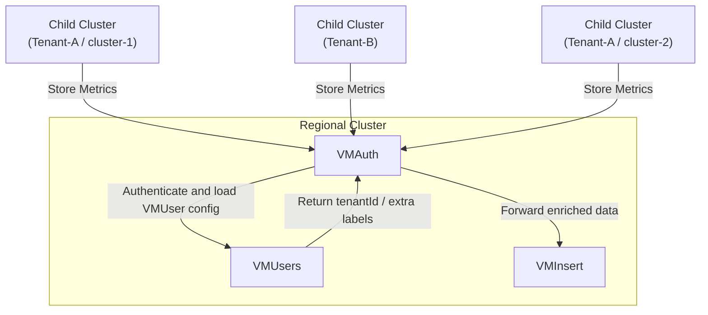
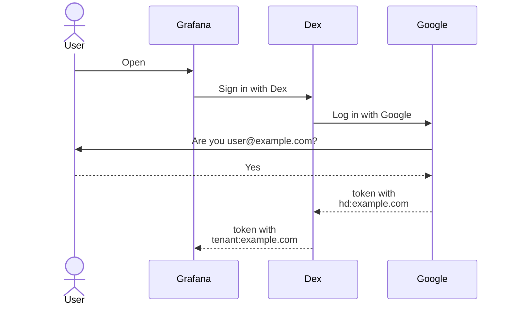
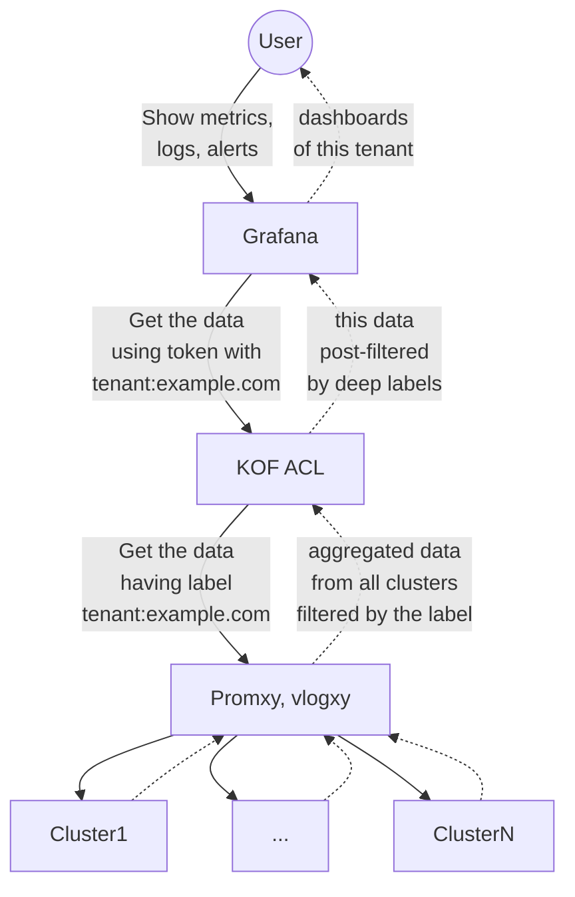

# Multi-tenancy in KOF

## Overview

KOF supports multi-tenancy to isolate data (metrics, logs, and traces) between tenants. In the current implementation, a tenant is an organization with child clusters.

## Architecture

Multi-tenancy is enforced by **VMAuth** using **VMUser** resources. Each cluster gets a separate VMUser automatically.
When a tenant ID label is specified, the VMUser is configured with:

- **ExtraLabels**: adds `tenantId=<TENANT_ID>` to all ingested metrics, logs, and traces
- **ExtraFilters**: restricts read access to data matching the specified `tenantId`



This configuration ensures full isolation between tenants, allowing each to access only their own metrics, logs, and traces.

> NOTE:
> VMUser resources on regional clusters have administrative access without ExtraFilters restrictions, enabling cross-tenant data access.

## How to Enable Multi-tenancy

Add the tenant identification label to child `ClusterDeployment` resources:

```yaml
k0rdent.mirantis.com/kof-tenant-id: <TENANT_ID>
```

Dependent resources (secrets, VMUser object) will be updated or created automatically. See [storage credentials](https://github.com/k0rdent/kof/blob/main/docs/storage-creds.md) for details.

The next examples assume:

* [Dex SSO](kof-grafana.md#single-sign-on) is deployed to `dex.example.com`
* Optional [Grafana in KOF](kof-grafana.md) integration is enabled.
    Some other dashboarding tools may be connected in the same way.
* Google is used as an OIDC provider.
    Any other [OIDC provider](https://dexidp.io/docs/connectors/oidc/) can be used.

## Single Sign-On

KOF uses [Dex SSO](kof-grafana.md#single-sign-on) to identify the tenant of the user:



## Access Control

Once the tenant is identified, KOF ACL service enforces the filtering of the data:



## Sign In Options

KOF provides multiple options to sign in to [Grafana](kof-grafana.md) for different levels of access.

### Full Access

Username and password from [grafana-admin-credentials](kof-grafana.md#install-and-enable-grafana)
grant full access to all tenants and features.

### SSO Admin

"Sign in with Dex" followed by "Log in with Email" grants access to all tenants and limited features.

To enable this option, get admin email and password hash,
and apply the `kof-values.yaml` patch to the [Management Cluster](kof-install.md/#management-cluster)
using this example:

```bash
ADMIN_EMAIL=$(git config user.email)
ADMIN_PASSWORD_HASH=$(htpasswd -BnC 10 admin | cut -d: -f2)

cat <<EOF
kof-mothership:
  values:
    kcm:
      kof:
        acl:
          enabled: true
          replicaCount: 1
          extraArgs:
            issuer: https://dex.example.com:32000
            admin-email: "$ADMIN_EMAIL"
    dex:
      enabled: true
      config:
        connectors: []
        issuer: https://dex.example.com:32000
        enablePasswordDB: true
        staticPasswords:
          - email: "$ADMIN_EMAIL"
            hash: "$ADMIN_PASSWORD_HASH"
            username: "admin"
            userID: "1"
        oauth2:
          passwordConnector: local
        staticClients:
          - id: grafana-id
            redirectURIs:
              - "http://localhost:3000/login/generic_oauth"
            name: Grafana
            secret: grafana-secret
EOF
```

### SSO User

"Sign in with Dex" followed by "Log in with Google" grants access to a single tenant and limited features.

To enable this option, get your existing `<GOOGLE_CLIENT_ID>` and `<GOOGLE_CLIENT_SECRET>`
or create the new ones:

* Open the [Google Cloud Console](https://console.cloud.google.com/).
* Create a project, e.g. `dex`
* Configure OAuth screen:
    * Audience: Internal (initially, while you're testing it)
* Create OAuth client:
    * App type: Web app
    * Authorized JavaScript origins: `https://dex.example.com:32000`
    * Authorized redirect URIs: `https://dex.example.com:32000/callback`
    * Create, download JSON with creds, copy `client_id` and `client_secret`.

Now apply the [SSO Admin](#sso-admin) patch with the next part added,
replacing `<GOOGLE_CLIENT_ID>` and `<GOOGLE_CLIENT_SECRET>`:

```yaml
kof-mothership:
  values:
    dex:
      config:
        connectors:
          - type: oidc
            id: google
            name: Google
            config:
              issuer: https://accounts.google.com
              clientID: "<GOOGLE_CLIENT_ID>"
              clientSecret: "<GOOGLE_CLIENT_SECRET>"
              redirectURI: https://dex.example.com:32000/callback
              insecureEnableGroups: true
              claimModifications:
                newGroupFromClaims:
                  - prefix: tenant
                    delimiter: ":"
                    clearDelimiter: false
                    claims:
                      - hd
              scopes:
                - openid
                - email
                - profile
```

Details:

* If your OIDC provider creates ID token with `tenant` claim,
    KOF ACL uses it to identify the tenant.
* Google ID token doesn't have `tenant` claim,
    but it has the [`hd` claim](https://developers.google.com/identity/openid-connect/openid-connect#id_token-hd)
    (Hosted Domain associated with the Google Workspace or Cloud organization of the user)
    with a value like `example.com`.
* Dex supports [claimMapping](https://dexidp.io/docs/connectors/oidc/#configuration)
    of a non-standard claim like `hd` to a standard one,
    but the `tenant` is not one of the [standard claims](https://openid.net/specs/openid-connect-core-1_0.html#Claims).
* So the [claimModifications](https://dexidp.io/docs/connectors/oidc/#configuration)
    in the Dex configuration above add a new group like `tenant:example.com` to the `groups` claim.
* KOF ACL finds the `tenant:...` group in the `groups` claim to identify the tenant.
