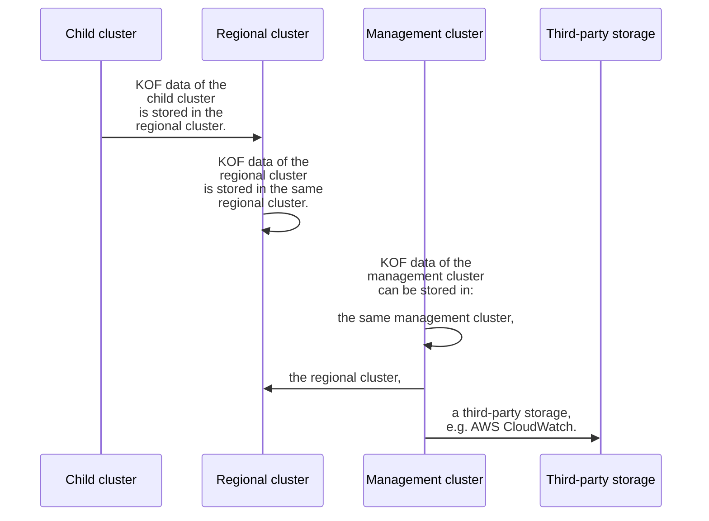

# Storing KOF data

## Overview

KOF data (metrics, logs, traces) can be collected from each cluster and stored in specific places:



## From Child and Regional

KOF data collected from the child and regional clusters is routed out-of-the box.
No additional steps are required here.

## From Management to Management

This option stores KOF data of the management cluster in the same management cluster.

* Grafana and VictoriaMetrics are provided by the `kof-mothership` chart,
  hence disabled in the `kof-storage` chart.
* PromxyServerGroup, VictoriaLogs, and Jaeger are provided by the `kof-storage` chart.

To apply this option:

1. Create the `storage-values.yaml` file:
    ```yaml
    grafana:
      enabled: false
      security:
        create_secret: false
    victoria-metrics-operator:
      enabled: false
    victoriametrics:
      enabled: false
    promxy:
      enabled: true
    ```

    If you want to use a non-default storage class, add to the `storage-values.yaml` file:
    ```yaml
    victoria-logs-cluster:
      vlstorage:
        persistentVolume:
          storageClassName: <EXAMPLE_STORAGE_CLASS>
    ```

2. Create the `collectors-values.yaml` file:
    ```yaml
    kcm:
      monitoring: true
    opentelemetry-kube-stack:
      clusterName: mothership
      defaultCRConfig:
        config:
          processors:
            resource/k8sclustername:
              attributes:
                - action: insert
                  key: k8s.cluster.name
                  value: mothership
                - action: insert
                  key: k8s.cluster.namespace
                  value: kcm-system
          exporters:
            prometheusremotewrite:
              external_labels:
                cluster: mothership
                clusterNamespace: kcm-system
    ```

3. Install the `kof-storage` and `kof-collectors` charts to the management cluster:
    ```shell
    helm upgrade -i --reset-values --wait -n kof kof-storage \
      -f storage-values.yaml \
      oci://ghcr.io/k0rdent/kof/charts/kof-storage --version {{{ extra.docsVersionInfo.kofVersions.kofDotVersion }}}

    helm upgrade -i --reset-values --wait -n kof kof-collectors \
      -f collectors-values.yaml \
      oci://ghcr.io/k0rdent/kof/charts/kof-collectors --version {{{ extra.docsVersionInfo.kofVersions.kofDotVersion }}}
    ```

## From Management to Regional

This option stores KOF data of the management cluster in the regional cluster.

It assumes that:

* You did not enable Istio.
* You have a regional cluster with the `REGIONAL_DOMAIN` configured [here](./kof-install.md#regional-cluster).

To apply this option:

1. Create the `collectors-values.yaml` file:
    ```shell
    cat >collectors-values.yaml <<EOF
    kcm:
      monitoring: true
    opentelemetry-kube-stack:
      clusterName: mothership
      defaultCRConfig:
        env:
          - name: KOF_VM_USER
            valueFrom:
              secretKeyRef:
                key: username
                name: storage-vmuser-credentials
          - name: KOF_VM_PASSWORD
            valueFrom:
              secretKeyRef:
                key: password
                name: storage-vmuser-credentials
          - name: KOF_JAEGER_USER
            valueFrom:
              secretKeyRef:
                key: username
                name: jaeger-credentials
          - name: KOF_JAEGER_PASSWORD
            valueFrom:
              secretKeyRef:
                key: password
                name: jaeger-credentials
        config:
          processors:
            resource/k8sclustername:
              attributes:
                - action: insert
                  key: k8s.cluster.name
                  value: mothership
                - action: insert
                  key: k8s.cluster.namespace
                  value: kcm-system
          extensions:
            basicauth/metrics:
              client_auth:
                username: ${env:KOF_VM_USER}
                password: ${env:KOF_VM_PASSWORD}
            basicauth/logs:
              client_auth:
                username: ${env:KOF_VM_USER}
                password: ${env:KOF_VM_PASSWORD}
            basicauth/traces:
              client_auth:
                username: ${env:KOF_JAEGER_USER}
                password: ${env:KOF_JAEGER_PASSWORD}
          exporters:
            prometheusremotewrite:
              endpoint: https://vmauth.$REGIONAL_DOMAIN/vm/insert/0/prometheus/api/v1/write
              auth:
                authenticator: basicauth/metrics
              external_labels:
                cluster: mothership
                clusterNamespace: kcm-system
            otlphttp/logs:
              logs_endpoint: https://vmauth.$REGIONAL_DOMAIN/vls/insert/opentelemetry/v1/logs
              auth:
                authenticator: basicauth/logs
            otlphttp/traces:
              endpoint: https://jaeger.$REGIONAL_DOMAIN/collector
              auth:
                authenticator: basicauth/traces
          service:
            extensions:
              - basicauth/metrics
              - basicauth/logs
              - basicauth/traces
    opencost:
      opencost:
        prometheus:
          external:
            url: https://vmauth.$REGIONAL_DOMAIN/vm/select/0/prometheus
    EOF
    ```

2. Install the `kof-collectors` chart to the management cluster:
    ```shell
    helm upgrade -i --reset-values --wait -n kof kof-collectors \
      -f collectors-values.yaml \
      oci://ghcr.io/k0rdent/kof/charts/kof-collectors --version {{{ extra.docsVersionInfo.kofVersions.kofDotVersion }}}
    ```

## From Management to Regional with Istio

This option stores KOF data of the management cluster in the regional cluster using Istio.

It assumes that:

* You have Istio enabled.
* You have a regional cluster with the `REGIONAL_CLUSTER_NAME` configured [here](./kof-install.md#regional-cluster).

To apply this option:

1. Create the `collectors-values.yaml` file:
    ```shell
    cat >collectors-values.yaml <<EOF
    kcm:
      monitoring: true
    kof:
      basic_auth: false
    opentelemetry-kube-stack:
      clusterName: mothership
      defaultCRConfig:
        config:
          processors:
            resource/k8sclustername:
              attributes:
                - action: insert
                  key: k8s.cluster.name
                  value: mothership
                - action: insert
                  key: k8s.cluster.namespace
                  value: kcm-system
          exporters:
            prometheusremotewrite:
              endpoint: http://$REGIONAL_CLUSTER_NAME-vminsert:8480/insert/0/prometheus/api/v1/write
              external_labels:
                cluster: mothership
                clusterNamespace: kcm-system
            otlphttp/logs:
              logs_endpoint: http://$REGIONAL_CLUSTER_NAME-logs:9428/insert/opentelemetry/v1/logs
            otlphttp/traces:
              endpoint: http://$REGIONAL_CLUSTER_NAME-jaeger-collector:4318
    opencost:
      opencost:
        prometheus:
          existingSecretName: ""
          external:
            url: http://$REGIONAL_CLUSTER_NAME-vmselect:8481/select/0/prometheus
    EOF
    ```

2. Install the `kof-collectors` chart to the management cluster:
    ```shell
    helm upgrade -i --reset-values --wait -n kof kof-collectors \
      -f collectors-values.yaml \
      oci://ghcr.io/k0rdent/kof/charts/kof-collectors --version {{{ extra.docsVersionInfo.kofVersions.kofDotVersion }}}
    ```

## From Management to Third-party

This option stores KOF data of the management cluster in a third-party storage,
using the [AWS CloudWatch Logs Exporter](https://github.com/open-telemetry/opentelemetry-collector-contrib/tree/main/exporter/awscloudwatchlogsexporter#readme) as an example.

Use the most secure option to [specify AWS credentials](https://docs.aws.amazon.com/sdk-for-go/v1/developer-guide/configuring-sdk.html#specifying-credentials) in production.

For now, however, just for the sake of this demo, you can use the most straightforward
(though less secure) static credentials method:

1. Create AWS IAM user with access to CloudWatch Logs,
    for example, with `"Action": "logs:*"` allowed in the inline policy.

2. Create access key and save it to the `cloudwatch-credentials` file:
    ```
    AWS_ACCESS_KEY_ID=REDACTED
    AWS_SECRET_ACCESS_KEY=REDACTED
    ```

3. Create the `cloudwatch-credentials` secret:
    ```shell
    kubectl create secret generic -n kof cloudwatch-credentials \
      --from-env-file=cloudwatch-credentials
    ```

4. Create the `collectors-values.yaml` file:
    ```shell
    cat >collectors-values.yaml <<EOF
    kcm:
      monitoring: true
    opentelemetry-kube-stack:
      clusterName: mothership
      defaultCRConfig:
        env:
          - name: AWS_ACCESS_KEY_ID
            valueFrom:
              secretKeyRef:
                name: cloudwatch-credentials
                key: AWS_ACCESS_KEY_ID
          - name: AWS_SECRET_ACCESS_KEY
            valueFrom:
              secretKeyRef:
                name: cloudwatch-credentials
                key: AWS_SECRET_ACCESS_KEY
        config:
          processors:
            resource/k8sclustername:
              attributes:
                - action: insert
                  key: k8s.cluster.name
                  value: mothership
                - action: insert
                  key: k8s.cluster.namespace
                  value: kcm-system
          exporters:
            awscloudwatchlogs:
              region: us-east-2
              log_group_name: management
              log_stream_name: logs
            prometheusremotewrite: null
            otlphttp/logs: null
            otlphttp/traces: null
          service:
            pipelines:
              logs:
                exporters:
                - awscloudwatchlogs
                - debug
              metrics:
                exporters:
                - debug
              traces:
                exporters:
                - debug
    EOF
    ```

5. Install the `kof-collectors` chart to the management cluster:
    ```shell
    helm upgrade -i --reset-values --wait -n kof kof-collectors \
      -f collectors-values.yaml \
      oci://ghcr.io/k0rdent/kof/charts/kof-collectors --version {{{ extra.docsVersionInfo.kofVersions.kofDotVersion }}}
    ```

6. Configure AWS CLI with the same access key, for verification:
    ```shell
    aws configure
    ```

7. Verify that the management cluster logs are stored in the CloudWatch:
    ```shell
    aws logs get-log-events \
      --region us-east-2 \
      --log-group-name management \
      --log-stream-name logs \
      --limit 1
    ```
    Example of the output:
    ```
    {"events": [{
      "timestamp": 1744305535107,
      "message": "{\"body\":\"10.244.0.1 - - [10/Apr/2025 17:18:55] \\\"GET /-/ready HTTP/1.1 200 ...
    ```
