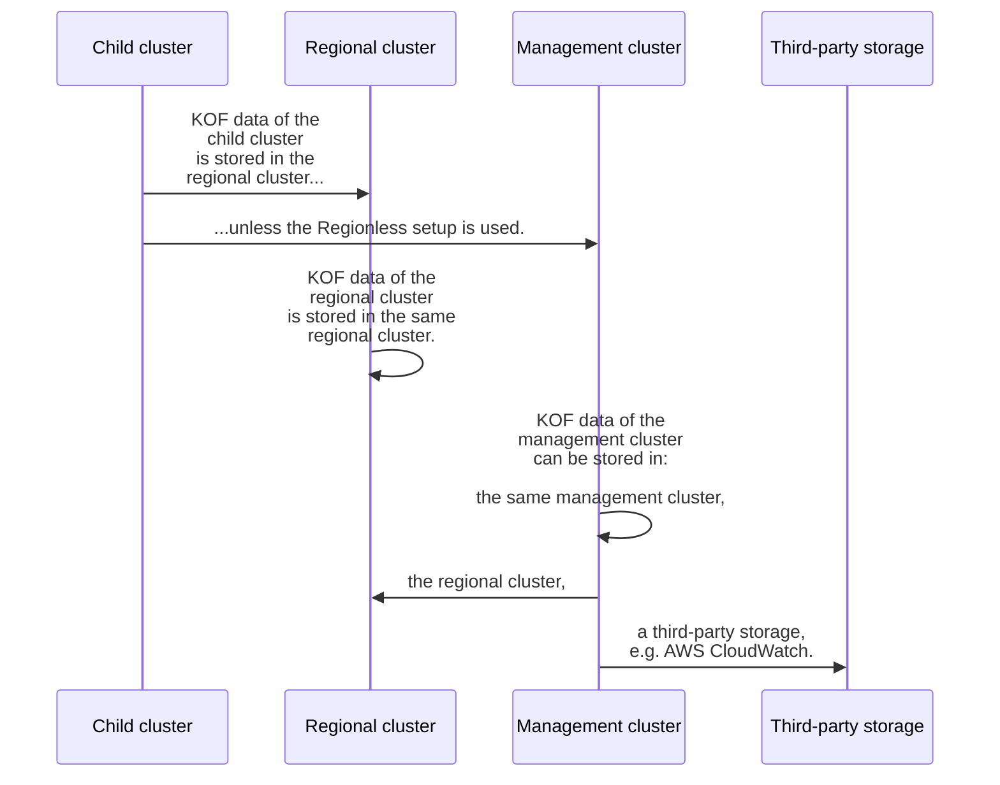

# Storing KOF data

## Overview

KOF data (metrics, logs, traces) can be collected from each cluster and stored in specific places:


```mermaid
sequenceDiagram
    Child cluster->>Regional cluster: KOF data of the<br>child cluster<br>is stored in the<br>regional cluster...
    Child cluster->>Management cluster: ...unless the Regionless setup is used.
    Regional cluster->>Regional cluster: KOF data of the<br>regional cluster<br>is stored in the same<br>regional cluster.
    Management cluster->>Management cluster: KOF data of the<br>management cluster<br>can be stored in:<br><br>the same management cluster,
    Management cluster->>Regional cluster: the regional cluster,
    Management cluster->>Third-party storage: a third-party storage,<br>e.g. AWS CloudWatch.
```

## Storage Class Requirements for VictoriaMetrics Cluster

When deploying VictoriaMetrics Cluster (used by KOF for metrics storage), consider the following Kubernetes storage class requirements:

- **ReadWriteMany:** Not required. Each `vmstorage` pod uses its own PersistentVolumeClaim (PVC) and does not share volumes with other pods. A `ReadWriteOnce` access mode is sufficient and recommended for most environments.
- **Reclaim Policy:** The default `Delete` policy is typically used, but you may choose `Retain` if you want to preserve data after PVC deletion for manual recovery.
- **Volume Expansion:** Enabling volume expansion is recommended. VictoriaMetrics can benefit from expanding storage as your data grows, and resizing PVCs is supported by most modern storage classes.
- **Required Space:** Storage requirements depend on your metrics volume, retention period, and replication factor. As a starting point, allocate at least 10–50 GiB per `vmstorage` pod for small clusters, and plan for growth based on actual ingestion rates and retention settings.
- **Volume Binding Mode:** `WaitForFirstConsumer` is recommended for better pod scheduling and to ensure volumes are provisioned in the correct availability zone or node pool.

See also [KOF Retention and Replication](kof-retention.md) guide
and [From Management to Management](#from-management-to-management) option
for the non-default storage class, space, retention, and replication details.

## Regionless

In the regionless setup there are no regional clusters.
All child clusters and the management cluster send their metrics/logs/traces
to the management cluster for storage.

> WARNING:
> If you already have regional clusters, applying this option unprovisions them,
> which may result in data loss.
> Create backups as described in the [Data Backup](kof-upgrade.md#data-backup) section
> for all regional clusters.

To apply this option:

1. Merge this patch to the existing `kof-values.yaml`:

    ```yaml
    regionless:
      enabled: true
    ```

    ??? note "If you have applied the [Istio](kof-install.md#istio) section:"

        To allow child clusters to communicate with the management cluster,
        use the following values during the Istio installation or upgrade:

        ```
        --set managementCluster.includeInMesh=true \
        --set managementCluster.apiServer="https://EXAMPLE-control-plane:6443" \
        --set-json 'gateway.resource.spec.servers[0]={"port":{"number":15443,"name":"tls","protocol":"TLS"},"tls":{"mode":"AUTO_PASSTHROUGH"},"hosts":["mothership-vmauth.kof.svc.cluster.local"]}'
        ```

        * With `managementCluster.includeInMesh` the management cluster itself is enrolled as a mesh member.
            This will bootstrap Istio resources (remote secret, CA certificate, and east-west gateway)
            for the management cluster in addition to the child clusters.
        * The `managementCluster.apiServer` should be the externally accessible URL
            of the management cluster Kubernetes API server.
            This value is required when `includeInMesh` is set to `true`,
            so that Istiod on child clusters can reach the management cluster API server.
            Without this value, child clusters will not be able to access the management cluster.
        * Note the `mothership-vmauth` instead of `{clusterName}-vmauth` in the `--set-json` line.
            It is aligned with the default `regionless.clusterName=mothership` value.

        > WARNING:
        > By default, this creates an Istio Gateway resource that allows child clusters
        > to access **any service** of the management cluster.
        > You can use `gateway.resource` to customize the resource for your needs
        > and restrict access only to the services you require.

    ??? note "If you have not applied the Istio:"

        Merge to `kof-values.yaml`:

        ```yaml
        regionless:
          domain: mothership.kof.example.com
        ```

        Use your own domain. Child clusters will send KOF data to `https://vmauth.{domain}`.

    ??? note "If you need self-signed / insecure TLS:"

        Merge to `kof-values.yaml`:

        ```yaml
        tls:
          selfSigned: true
          insecureSkipVerify: true
        ```

    ??? note "If you want to use a non-default storage class, space, retention, replication:"

        Adjust and merge this:

        ```yaml
        kof-regional:
          values:
            storage:
              victoriametrics:
                # ...
              victoria-logs-cluster:
                # ...
              victoria-traces-cluster:
                # ...
        ```

        See details in the [KOF Retention and Replication](kof-retention.md) guide.

2. Apply `kof-values.yaml` to the [Management Cluster](kof-install.md/#management-cluster):



## From Child and Regional

KOF data collected from the child and regional clusters is routed out-of-the box.
No additional steps are required here.

## From Management to Management

This option stores KOF data of the management cluster in the same management cluster.

If you're using the [Regionless](#regionless) setup, no additional steps are needed.

Otherwise, to apply this option:

1. Merge this patch to the existing `kof-values.yaml`:

    ```yaml
    kof-child:
      values:
        fromManagement:
          toManagementCluster:
            enabled: true
    ```

    ??? note "If your management cluster is not [k0s](https://k0sproject.io/):"

        KOF scrapes `etcd` metrics using cert files like
        `/hostfs/${env:PKI_PATH}/pki/apiserver-etcd-client.crt`

        If you have `PKI_PATH` other than `var/lib/k0s`,
        e.g. when testing with [kind](https://kind.sigs.k8s.io/), merge this:

        ```yaml
        kof-child:
          values:
            fromManagement:
              collectors:
                opentelemetry-kube-stack:
                  defaultCRConfig:
                    env:
                      - name: PKI_PATH
                        value: etc/kubernetes
        ```

    ??? note "If you want to use a non-default storage class, space, retention, replication:"

        Adjust and merge this:

        ```yaml
        kof-mothership:
          values:
            victoriametrics:
              # ...
        kof-child:
          values:
            storage:
              victoria-logs-cluster:
                # ...
              victoria-traces-cluster:
                vtstorage:
                  extraArgs:
                    retentionPeriod: "30d"
                  persistentVolume:
                    storageClassName: <EXAMPLE_STORAGE_CLASS>
                    size: "100Gi"
              victoriametrics:
                vlcluster_audit:
                  spec:
                    vlstorage:
                      retentionPeriod: "1y"
                      storage:
                        volumeClaimTemplate:
                          spec:
                            storageClassName: <EXAMPLE_STORAGE_CLASS>
                            resources:
                              requests:
                                storage: "100Gi"
        ```

        To disable the audit logs cluster entirely, set `vlcluster_audit.enabled: false`
        under `kof-storage.values`.

        See details in the [KOF Retention and Replication](kof-retention.md) guide.

2. Apply `kof-values.yaml` to the [Management Cluster](kof-install.md/#management-cluster):



## From Management to Regional

This option stores KOF data of the management cluster in the regional cluster.

To apply this option:

1. Merge this patch to the existing `kof-values.yaml`:

    ```yaml
    kof-child:
      values:
        fromManagement:
          toRegionalCluster:
            name: $REGIONAL_CLUSTER_NAME
    ```

    Make sure to replace `$REGIONAL_CLUSTER_NAME` with its value configured [here](./kof-install.md#regional-cluster).

    ??? note "If your management cluster is not [k0s](https://k0sproject.io/):"

        KOF scrapes `etcd` metrics using cert files like
        `/hostfs/${env:PKI_PATH}/pki/apiserver-etcd-client.crt`

        If you have `PKI_PATH` other than `var/lib/k0s`,
        e.g. when testing with [kind](https://kind.sigs.k8s.io/), merge this:

        ```yaml
        kof-child:
          values:
            fromManagement:
              collectors:
                opentelemetry-kube-stack:
                  defaultCRConfig:
                    env:
                      - name: PKI_PATH
                        value: etc/kubernetes
        ```

2. Apply `kof-values.yaml` to the [Management Cluster](kof-install.md/#management-cluster):



## From Management to Third-party

This option stores KOF data of the management cluster in a third-party storage,
using the [AWS CloudWatch Logs Exporter](https://github.com/open-telemetry/opentelemetry-collector-contrib/tree/main/exporter/awscloudwatchlogsexporter#readme) as an example.

Use the most secure option to [specify AWS credentials](https://docs.aws.amazon.com/sdk-for-go/v1/developer-guide/configuring-sdk.html#specifying-credentials) in production.

For now, however, just for the sake of this demo, you can use the most straightforward
(though less secure) static credentials method:

1. Create AWS IAM user with access to CloudWatch Logs,
    for example, with `"Action": "logs:*"` allowed in the inline policy.

2. Create access key and save it to the `cloudwatch-credentials` file:
    ```
    AWS_ACCESS_KEY_ID=REDACTED
    AWS_SECRET_ACCESS_KEY=REDACTED
    ```

3. Create the `cloudwatch-credentials` secret:
    ```bash
    kubectl create secret generic -n kof cloudwatch-credentials \
      --from-env-file=cloudwatch-credentials
    ```

4. Merge this patch to the existing `kof-values.yaml`:

    ```yaml
    kof-collectors:
      enabled: true
      values:
        kcm:
          monitoring: true
        opentelemetry-kube-stack:
          clusterName: mothership
          defaultCRConfig:
            env:
              - name: AWS_ACCESS_KEY_ID
                valueFrom:
                  secretKeyRef:
                    name: cloudwatch-credentials
                    key: AWS_ACCESS_KEY_ID
              - name: AWS_SECRET_ACCESS_KEY
                valueFrom:
                  secretKeyRef:
                    name: cloudwatch-credentials
                    key: AWS_SECRET_ACCESS_KEY
            config:
              processors:
                resource/k8sclustername:
                  attributes:
                    - action: insert
                      key: k8s.cluster.name
                      value: mothership
                    - action: insert
                      key: k8s.cluster.namespace
                      value: kcm-system
              exporters:
                awscloudwatchlogs:
                  region: us-east-2
                  log_group_name: management
                  log_stream_name: logs
                prometheusremotewrite: null
                otlphttp/logs: null
                otlphttp/traces: null
              service:
                pipelines:
                  logs:
                    exporters:
                    - awscloudwatchlogs
                    - debug
                  metrics:
                    exporters:
                    - debug
                  traces:
                    exporters:
                    - debug
    ```

    ??? note "If your management cluster is not [k0s](https://k0sproject.io/):"

        KOF scrapes `etcd` metrics using cert files like
        `/hostfs/${env:PKI_PATH}/pki/apiserver-etcd-client.crt`

        If you have `PKI_PATH` other than `var/lib/k0s`,
        e.g. when testing with [kind](https://kind.sigs.k8s.io/), merge this:

        ```yaml
        kof-collectors:
          values:
            opentelemetry-kube-stack:
              defaultCRConfig:
                env:
                  - name: PKI_PATH
                    value: etc/kubernetes
        ```

        Please take especial care merging the `env` list manually to avoid overwriting it.

5. Apply `kof-values.yaml` to the [Management Cluster](kof-install.md/#management-cluster):



6. Configure AWS CLI with the same access key, for verification:
    ```bash
    aws configure
    ```

7. Verify that the management cluster logs are stored in the CloudWatch:
    ```bash
    aws logs get-log-events \
      --region us-east-2 \
      --log-group-name management \
      --log-stream-name logs \
      --limit 1
    ```
    Example of the output:
    ```
    {"events": [{
      "timestamp": 1744305535107,
      "message": "{\"body\":\"10.244.0.1 - - [10/Apr/2025 17:18:55] \\\"GET /-/ready HTTP/1.1 200 ...
    ```
