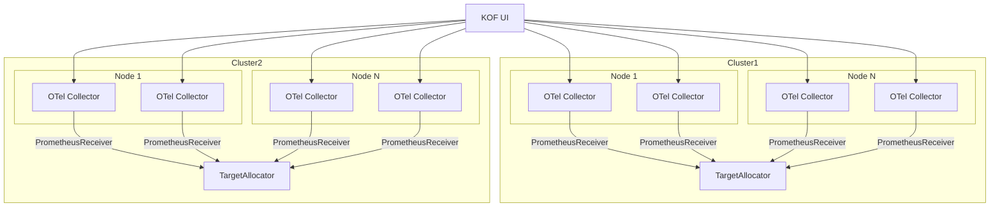

# Using KOF

Most of the time, you'll access KOF's data through Grafana.

## Access to Grafana

To make Grafana available, follow these steps:

1. Get the Grafana username and password:
    ```shell
    kubectl get secret -n kof grafana-admin-credentials -o yaml | yq '{
      "user": .data.GF_SECURITY_ADMIN_USER | @base64d,
      "pass": .data.GF_SECURITY_ADMIN_PASSWORD | @base64d
    }'
    ```

2. Forward a port to the Grafana dashboard:
    ```shell
    kubectl port-forward -n kof svc/grafana-vm-service 3000:3000
    ```

3. Login to [http://127.0.0.1:3000/dashboards](http://127.0.0.1:3000/dashboards) with the username/password printed above.

4. Open a dashboard and select any cluster:


### Cluster Overview

From here you can get an overview of the cluster, including:

* Health metrics
* Resource utilization
* Performance trends
* Cost analysis

### Logging Interface

The logging interface will also be available, including:

* Real-time log streaming
* Full-text search
* Log aggregation
* Alert correlation

<video controls width="1024" style="max-width: 100%">
  <source src="../../../assets/kof/victoria-logs-dashboard--2025-03-11.mp4" type="video/mp4" />
</video>

### Cost Management

Finally there are the cost management features, including:

* Resource cost tracking
* Usage analysis
* Budget monitoring
* Optimization recommendations

## Access to Jaeger

[Jaeger UI](https://www.jaegertracing.io/docs/2.5/frontend-ui/#trace-page) of each regional cluster can be accessed by following these steps:

1. Ensure you have the `regional-kubeconfig` file created on the [verification step](./kof-verification.md#verification-steps).

2. If you've applied the [Istio](./kof-install.md#istio) section:

    * Forward a port to the Jaeger UI:
        ```shell
        KUBECONFIG=regional-kubeconfig kubectl port-forward \
          -n kof svc/kof-storage-jaeger-query 16686:16686
        ```

    * Open the link [http://127.0.0.1:16686/search](http://127.0.0.1:16686/search)
      and explore the Jaeger UI.

3. If you have not applied the [Istio](./kof-install.md#istio) section:

    * Ensure you have the `REGIONAL_DOMAIN` variable set on the [installation step](./kof-install.md#regional-cluster).

    * Get the regional Jaeger username and password:
        ```shell
        KUBECONFIG=regional-kubeconfig kubectl get secret \
          -n kof jaeger-credentials -o yaml | yq '{
          "user": .data.username | @base64d,
          "pass": .data.password | @base64d
        }'
        ```

    * Get the the Jaeger UI URL, open it,
        and login with the username/password printed above:
        ```shell
        echo https://jaeger.$REGIONAL_DOMAIN
        ```

## Access to KOF UI

When the [TargetAllocator](https://opentelemetry.io/docs/platforms/kubernetes/operator/target-allocator/) is in use,
the configuration of [OpenTelemetryCollectors](https://opentelemetry.io/docs/collector/)
Prometheus [receivers](https://github.com/open-telemetry/opentelemetry-collector-contrib/tree/main/receiver/prometheusreceiver#prometheus-api-server)
is distributed across the cluster.

KOF UI collects metrics metadata from the same endpoints that are scraped by Prometheus server:



KOF UI can be accessed by following these steps:

1. Forward a port to KOF UI:

    ```shell
    kubectl port-forward -n kof deploy/kof-mothership-kof-operator 9090:9090
    ```

2. Open the link [http://127.0.0.1:9090](http://127.0.0.1:9090)

3. Check the state of the endpoints:


