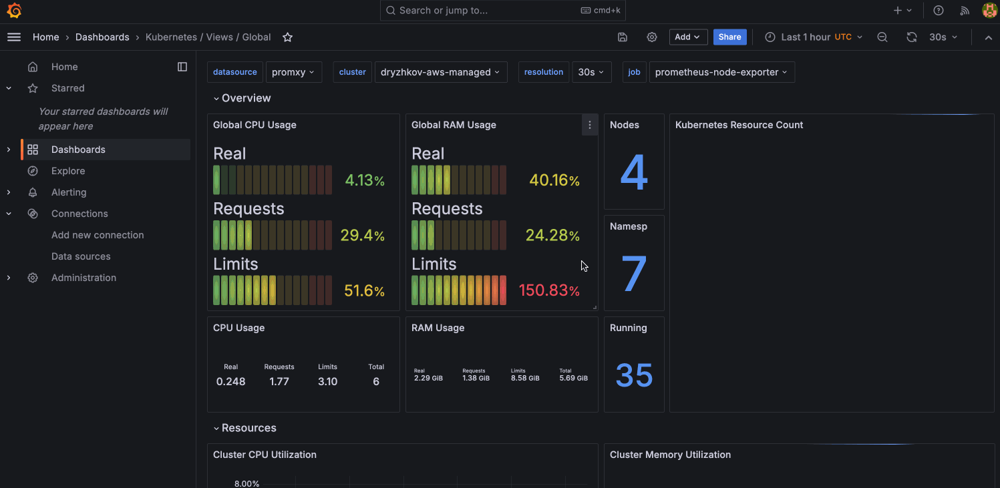

# k0rdent Observability and FinOps (kof)

## Overview

[kof](https://github.com/k0rdent/kof) provides enterprise-grade observability
and FinOps capabilities for k0rdent-managed Kubernetes clusters.
It enables centralized metrics, logging, and cost management
through a unified [OpenTelemetry](https://opentelemetry.io/docs/)-based architecture.

## Architecture

### High-level

3 layers: Management, Storage, Collection.

```
           ┌────────────────┐
           │   Management   │
           │   UI, promxy   │
           └────────┬───────┘
                    │
             ┌──────┴──────┐
             │             │
        ┌────┴─────┐ ┌─────┴────┐
        │ Storage  │ │ Storage  │
        │ region 1 │ │ region 2 │
        └────┬─────┘ └─────┬────┘
             │             │
      ┌──────┴──────┐     ...
      │             │
┌─────┴─────┐ ┌─────┴─────┐
│ Collect   │ │ Collect   │
│ managed 1 │ │ managed 2 │
└───────────┘ └───────────┘
```

### Mid-level

Data flows up - from observed resources to centralized Grafana:

```
management cluster_____________________
│                                     │
│  kof-mothership chart_____________  │
│  │                               │  │
│  │ centralized Grafana & storage │  │
│  │                               │  │
│  │ promxy                        │  │
│  │_______________________________│  │
│                                     │
│  kof-operators chart_____________   │
│  │                              │   │
│  │  opentelemetry-operator      │   │
│  │  prometheus-operator-crds    │   │
│  │______________________________│   │
│_____________________________________│


cloud 1...
│
│  region 1__________________________________________  region 2...
│  │                                                │  │
.  │  storage cluster_____________________          │  │
.  │  │                                  │          │  │
.  │  │  kof-storage chart_____________  │          │  .
   │  │  │                            │  │          │  .
   │  │  │ regional Grafana & storage │  │          │  .
   │  │  │____________________________│  │          │
   │  │                                  │          │
   │  │  cert-manager                    │          │
   │  │  ingress-nginx                   │          │
   │  │__________________________________│          │
   │                                                │
   │                                                │
   │  managed cluster 1_____________________  2...  │
   │  │                                    │  │     │
   │  │  kof-operators chart_____________  │  │     │
   │  │  │                              │  │  │     │
   │  │  │  opentelemetry-operator____  │  │  .     │
   │  │  │  │                        │  │  │  .     │
   │  │  │  │ OpenTelemetryCollector │  │  │  .     │
   │  │  │  │________________________│  │  │        │
   │  │  │                              │  │        │
   │  │  │  prometheus-operator-crds    │  │        │
   │  │  │______________________________│  │        │
   │  │                                    │        │
   │  │  kof-collectors chart________      │        │
   │  │  │                          │      │        │
   │  │  │ opencost                 │      │        │
   │  │  │ kube-state-metrics       │      │        │
   │  │  │ prometheus-node-exporter │      │        │
   │  │  │__________________________│      │        │
   │  │                                    │        │
   │  │  observed resources                │        │
   │  │____________________________________│        │
   │________________________________________________│
```

### Low-level


## Helm Charts

### kof-mothership

- Centralized [Grafana](https://grafana.com/) dashboard, managed by [grafana-operator](https://github.com/grafana/grafana-operator)
- Local [VictoriaMetrics](https://victoriametrics.com/) storage for alerting rules only, managed by [victoria-metrics-operator](https://docs.victoriametrics.com/operator/)
- [Sveltos](https://projectsveltos.github.io/sveltos/) dashboard, automatic secret distribution
- [cluster-api-visualizer](https://github.com/Jont828/cluster-api-visualizer) for insight into multicluster configuration
- [k0rdent](https://github.com/k0rdent) service templates to deploy other charts to regional clusters
- [Promxy](https://github.com/jacksontj/promxy) for aggregating Prometheus metrics from regional clusters

### kof-storage

- Regional [Grafana](https://grafana.com/) dashboard, managed by [grafana-operator](https://github.com/grafana/grafana-operator)
- Regional [VictoriaMetrics](https://victoriametrics.com/) storage with main data, managed by [victoria-metrics-operator](https://docs.victoriametrics.com/operator/)
    - [vmauth](https://docs.victoriametrics.com/vmauth/) entrypoint proxy for VictoriaMetrics components
    - [vmcluster](https://docs.victoriametrics.com/operator/resources/vmcluster/) for high-available fault-tolerant version of VictoriaMetrics database
    - [victoria-logs-single](https://github.com/VictoriaMetrics/helm-charts/tree/master/charts/victoria-logs-single) for high-performance, cost-effective, scalable logs storage
- [external-dns](https://github.com/kubernetes-sigs/external-dns) to communicate with other clusters

### kof-operators

- [prometheus-operator-crds](https://github.com/prometheus-community/helm-charts/tree/main/charts/prometheus-operator-crds) required to create OpenTelemetry collectors, also required to monitor `kof-mothership` itself
- [OpenTelemetry](https://opentelemetry.io/) [collectors](https://opentelemetry.io/docs/collector/) below, managed by [opentelemetry-operator](https://opentelemetry.io/docs/kubernetes/operator/)

### kof-collectors

- [prometheus-node-exporter](https://prometheus.io/docs/guides/node-exporter/) for hardware and OS metrics
- [kube-state-metrics](https://github.com/kubernetes/kube-state-metrics) (KSM) for metrics about the state of Kubernetes objects
- [OpenCost](https://www.opencost.io/) "shines a light into the black box of Kubernetes spend"

## Installation

### Prerequisites

- k0rdent management cluster - [quickstart guide](https://docs.k0rdent.io/v0.1.0/quickstart-1-mgmt-node-and-cluster/)
- Infrastructure provider credentials, e.g. [guide for AWS](https://docs.k0rdent.io/v0.1.0/quickstart-2-aws/)
    - Skip the "Create your ClusterDeployment" and later sections.
    - Ensure you've created [aws-cluster-identity-resource-template](https://github.com/k0rdent/kcm/blob/0acc940a746b733ef099169ee6247e1cc92bd041/config/dev/aws-credentials.yaml#L41-L49) - it is undocumented at the moment.
- Access to create DNS records for service endpoints, e.g. `kof.example.com`

### DNS auto-config

To avoid [manual configuration of DNS records for service endpoints](#manual-dns-config) later,
you can automate it now using [external-dns](https://kubernetes-sigs.github.io/external-dns/latest/).

E.g. for AWS you should use [Node IAM Role](https://github.com/kubernetes-sigs/external-dns/blob/master/docs/tutorials/aws.md#node-iam-role)
or [IRSA](https://github.com/kubernetes-sigs/external-dns/blob/master/docs/tutorials/aws.md#iam-roles-for-service-accounts) methods in production.

Just for the sake of this demo based on `aws-standalone` template for now,
we're using the most simple but less secure [Static credentials](https://github.com/kubernetes-sigs/external-dns/blob/master/docs/tutorials/aws.md#static-credentials) method:

- Create `external-dns` IAM user with [this policy](https://github.com/kubernetes-sigs/external-dns/blob/master/docs/tutorials/aws.md#iam-policy).
- Create an access key and `external-dns-aws-credentials` file:
  ```
  [default]
  aws_access_key_id = REDACTED
  aws_secret_access_key = REDACTED
  ```
- Create `external-dns-aws-credentials` secret in `kof` namespace:
  ```bash
  kubectl create namespace kof
  kubectl create secret generic \
    -n kof external-dns-aws-credentials \
    --from-file external-dns-aws-credentials
  ```

### Management Cluster

- Add kof helm repo to the k0rdent management cluster:
  ```bash
  helm repo add kof https://k0rdent.github.io/kof
  helm repo update
  helm search repo kof/
  ```
  It should list the [helm charts](#helm-charts) described above.

- Install `kof-operators` required by `kof-mothership`:
  ```bash
  helm upgrade -i --create-namespace -n kof kof-operators kof/kof-operators
  ```

- Compose the values for `kof-mothership`:

```bash
cat >mothership-values.yaml <<EOF
kcm:
  installTemplates: true
  kof:
    clusterProfiles:
      kof-aws-dns-secrets:
        matchLabels:
          k0rdent.mirantis.com/kof-aws-dns-secrets: "true"
        secrets:
          - external-dns-aws-credentials
EOF
```

- Why we override some [default values](https://github.com/k0rdent/kof/blob/main/charts/kof-mothership/values.yaml) here:
    - `kcm.installTemplates` installs the templates like `cert-manager` and `kof-storage` into the management cluster. This allows to reference them from `.spec.serviceSpec.services[].template` in AWS `ClusterDeployment` below.
    - `external-dns-aws-credentials` secret created in [DNS auto-config](#dns-auto-config) section is auto-distributed to storage clusters by Sveltos. If you've opted out of [DNS auto-config](#dns-auto-config) then don't add the `kof-aws-dns-secrets` cluster profile above.
    - `storage-vmuser-credentials` secret is auto-created by default and auto-distributed to other clusters by Sveltos `ClusterProfile` [here](https://github.com/k0rdent/kof/blob/121b61f5f6de6ddfdf3525b98f3ad4cb8ce57eaa/charts/kof-mothership/values.yaml#L25-L31).
    - `grafana-admin-credentials` secret is auto-created by default [here](https://github.com/k0rdent/kof/blob/121b61f5f6de6ddfdf3525b98f3ad4cb8ce57eaa/charts/kof-mothership/values.yaml#L64-L65). We will use it in the [Grafana](#grafana) section.

- Verify the values and install `kof-mothership`:
  ```bash
  cat mothership-values.yaml

  helm upgrade -i -n kof kof-mothership kof/kof-mothership -f mothership-values.yaml
  ```

- Wait for all pods to become `Running`:
  ```bash
  kubectl get pod -n kof
  ```

### Storage Cluster

- Look through the [default values](https://github.com/k0rdent/kof/blob/main/charts/kof-storage/values.yaml) of `kof-storage` chart.
- Apply the next quick start example for AWS, or use it as a reference.

- Set the next variables using your own values:
  ```bash
  STORAGE_CLUSTER_NAME=cloud1-region1
  STORAGE_DOMAIN=$STORAGE_CLUSTER_NAME.kof.example.com
  ADMIN_EMAIL=$(git config user.email)
  echo "$STORAGE_CLUSTER_NAME, $STORAGE_DOMAIN, $ADMIN_EMAIL"
  ```

- Use up to date template, e.g:
  ```bash
  kubectl get clustertemplate -n kcm-system | grep aws
  TEMPLATE=aws-standalone-cp-0-1-0
  ```

- Compose:
    - `ClusterDeployment` - storage cluster
    - `PromxyServerGroup` - for metrics
    - `GrafanaDatasource` - for logs

```bash
cat >storage-cluster.yaml <<EOF
apiVersion: k0rdent.mirantis.com/v1alpha1
kind: ClusterDeployment
metadata:
  name: $STORAGE_CLUSTER_NAME
  namespace: kcm-system
  labels:
    kof: storage
spec:
  template: $TEMPLATE
  credential: aws-cluster-identity-cred
  config:
    clusterIdentity:
      name: aws-cluster-identity
      namespace: kcm-system
    controlPlane:
      instanceType: t3.large
    controlPlaneNumber: 1
    publicIP: true
    region: us-east-2
    worker:
      instanceType: t3.medium
    workersNumber: 3
    clusterLabels:
      k0rdent.mirantis.com/kof-storage-secrets: "true"
      k0rdent.mirantis.com/kof-aws-dns-secrets: "true"
  serviceSpec:
    priority: 100
    services:
      - name: ingress-nginx
        namespace: ingress-nginx
        template: ingress-nginx-4-11-3
      - name: cert-manager
        namespace: cert-manager
        template: cert-manager-1-16-2
        values: |
          cert-manager:
            crds:
              enabled: true
      - name: kof-storage
        namespace: kof
        template: kof-storage
        values: |
          external-dns:
            enabled: true
          victoriametrics:
            vmauth:
              ingress:
                host: vmauth.$STORAGE_DOMAIN
            security:
              username_key: username
              password_key: password
              credentials_secret_name: storage-vmuser-credentials
          grafana:
            ingress:
              host: grafana.$STORAGE_DOMAIN
            security:
              credentials_secret_name: grafana-admin-credentials
          cert-manager:
            email: $ADMIN_EMAIL
---
apiVersion: kof.k0rdent.mirantis.com/v1alpha1
kind: PromxyServerGroup
metadata:
  labels:
    app.kubernetes.io/name: promxy-operator
    k0rdent.mirantis.com/promxy-secret-name: kof-mothership-promxy-config
  name: promxyservergroup-sample
  namespace: kof
spec:
  cluster_name: $STORAGE_CLUSTER_NAME
  targets:
    - "vmauth.$STORAGE_DOMAIN:443"
  path_prefix: /vm/select/0/prometheus/
  scheme: https
  http_client:
    dial_timeout: "5s"
    tls_config:
      insecure_skip_verify: true
    basic_auth:
      credentials_secret_name: storage-vmuser-credentials
      username_key: username
      password_key: password
---
apiVersion: grafana.integreatly.org/v1beta1
kind: GrafanaDatasource
metadata:
  labels:
    app.kubernetes.io/managed-by: Helm
  name: victoria-logs-storage0
  namespace: kof
spec:
  valuesFrom:
    - targetPath: "basicAuthUser"
      valueFrom:
        secretKeyRef:
          key: username
          name: storage-vmuser-credentials
    - targetPath: "secureJsonData.basicAuthPassword"
      valueFrom:
        secretKeyRef:
          key: password
          name: storage-vmuser-credentials
  datasource:
    name: $STORAGE_CLUSTER_NAME
    url: https://vmauth.$STORAGE_DOMAIN/vls
    access: proxy
    isDefault: false
    type: "victoriametrics-logs-datasource"
    basicAuth: true
    basicAuthUser: \${username}
    secureJsonData:
      basicAuthPassword: \${password}
  instanceSelector:
    matchLabels:
      dashboards: grafana
  resyncPeriod: 5m
EOF
```

- Verify and apply the Storage `ClusterDeployment`:
  ```bash
  cat storage-cluster.yaml

  kubectl apply -f storage-cluster.yaml
  ```

- Watch how cluster is deployed to AWS until all `READY` are `True`:
  ```bash
  clusterctl describe cluster -n kcm-system $STORAGE_CLUSTER_NAME --show-conditions all
  ```

### Managed Cluster

- Look through the default values of [kof-operators](https://github.com/k0rdent/kof/blob/main/charts/kof-operators/values.yaml)
  and [kof-collectors](https://github.com/k0rdent/kof/blob/main/charts/kof-collectors/values.yaml) charts.

- Apply the next quick start example for AWS, or use it as a reference.

- Set your own value below, verify [the variables](#storage-cluster):
  ```bash
  MANAGED_CLUSTER_NAME=$STORAGE_CLUSTER_NAME-managed1
  echo "$MANAGED_CLUSTER_NAME, $STORAGE_DOMAIN"
  ```

- Use up to date template, e.g:
  ```bash
  kubectl get clustertemplate -n kcm-system | grep aws
  TEMPLATE=aws-standalone-cp-0-1-0
  ```

- Compose the Managed `ClusterDeployment`:

```bash
cat >managed-cluster.yaml <<EOF
apiVersion: k0rdent.mirantis.com/v1alpha1
kind: ClusterDeployment
metadata:
  name: $MANAGED_CLUSTER_NAME
  namespace: kcm-system
  labels:
    kof: collector
spec:
  template: $TEMPLATE
  credential: aws-cluster-identity-cred
  config:
    clusterIdentity:
      name: aws-cluster-identity
      namespace: kcm-system
    controlPlane:
      instanceType: t3.large
    controlPlaneNumber: 1
    publicIP: false
    region: us-east-2
    worker:
      instanceType: t3.small
    workersNumber: 3
    clusterLabels:
      k0rdent.mirantis.com/kof-storage-secrets: "true"
  serviceSpec:
    priority: 100
    services:
      - name: cert-manager
        namespace: kof
        template: cert-manager-1-16-2
        values: |
          cert-manager:
            crds:
              enabled: true
      - template: kof-operators
        name: kof-operators
        namespace: kof
      - template: kof-collectors
        name: kof-collectors
        namespace: kof
        values: |
          global:
            clusterName: $MANAGED_CLUSTER_NAME
          opencost:
            enabled: true
            opencost:
              prometheus:
                username_key: username
                password_key: password
                existingSecretName: storage-vmuser-credentials
                external:
                  url: https://vmauth.$STORAGE_DOMAIN/vm/select/0/prometheus
              exporter:
                defaultClusterId: $MANAGED_CLUSTER_NAME
          kof:
            logs:
              username_key: username
              password_key: password
              credentials_secret_name: storage-vmuser-credentials
              endpoint: https://vmauth.$STORAGE_DOMAIN/vls/insert/opentelemetry/v1/logs
            metrics:
              username_key: username
              password_key: password
              credentials_secret_name: storage-vmuser-credentials
              endpoint: https://vmauth.$STORAGE_DOMAIN/vm/insert/0/prometheus/api/v1/write
EOF
```

- Verify and apply the Managed `ClusterDeployment`:
  ```bash
  cat managed-cluster.yaml

  kubectl apply -f managed-cluster.yaml
  ```

- Watch how cluster is deployed to AWS until all `READY` are `True`:
  ```bash
  clusterctl describe cluster -n kcm-system $MANAGED_CLUSTER_NAME --show-conditions all
  ```

### Verification

```bash
kubectl get secret -n kcm-system $STORAGE_CLUSTER_NAME-kubeconfig \
  -o=jsonpath={.data.value} | base64 -d > storage-kubeconfig

kubectl get secret -n kcm-system $MANAGED_CLUSTER_NAME-kubeconfig \
  -o=jsonpath={.data.value} | base64 -d > managed-kubeconfig

KUBECONFIG=storage-kubeconfig kubectl get pod -A
KUBECONFIG=managed-kubeconfig kubectl get pod -A
```
Wait for all pods to become `Running`.

### Manual DNS config

If you've opted out of [DNS auto-config](#dns-auto-config) then:

- Get the `EXTERNAL-IP` of `ingress-nginx`:
  ```bash
  KUBECONFIG=storage-kubeconfig kubectl get svc -n ingress-nginx ingress-nginx-controller
  ```
  It should look like `REDACTED.us-east-2.elb.amazonaws.com`

- Create the next DNS records of type `A` both pointing to that `EXTERNAL-IP`:
  ```bash
  echo vmauth.$STORAGE_DOMAIN
  echo grafana.$STORAGE_DOMAIN
  ```

## Sveltos

Use [Sveltos dashboard](https://projectsveltos.github.io/sveltos/getting_started/install/dashboard/#platform-administrator-example)
to verify secrets auto-distributed to required clusters:

```bash
kubectl create sa platform-admin
kubectl create clusterrolebinding platform-admin-access \
  --clusterrole cluster-admin --serviceaccount default:platform-admin

kubectl create token platform-admin --duration=24h
kubectl port-forward -n kof svc/dashboard 8081:80
```

- Open [http://127.0.0.1:8081/login](http://127.0.0.1:8081/login) and paste the token printed above.
- Open the `ClusterAPI` tab: [http://127.0.0.1:8081/sveltos/clusters/ClusterAPI/1](http://127.0.0.1:8081/sveltos/clusters/ClusterAPI/1)
- Check both storage and managed clusters:
    - Cluster profiles should be `Provisioned`.
    - Secrets should be distributed.


## Grafana

### Access to Grafana

- Get Grafana username and password:
  ```bash
  kubectl get secret -n kof grafana-admin-credentials -o yaml | yq '{
    "user": .data.GF_SECURITY_ADMIN_USER | @base64d,
    "pass": .data.GF_SECURITY_ADMIN_PASSWORD | @base64d
  }'
  ```

- Start Grafana dashboard:
  ```bash
  kubectl port-forward -n kof svc/grafana-vm-service 3000:3000
  ```

- Login to [http://127.0.0.1:3000/dashboards](http://127.0.0.1:3000/dashboards) with user/pass printed above.
- Open a dashboard:



### Cluster Overview

- Health metrics
- Resource utilization
- Performance trends
- Cost analysis

### Logging Interface

- Real-time log streaming
- Full-text search
- Log aggregation
- Alert correlation

### Cost Management

- Resource cost tracking
- Usage analysis
- Budget monitoring
- Optimization recommendations

## Scaling Guidelines

### Regional Expansion

- Deploy [Storage Cluster](#storage-cluster) in new region
- Update promxy configuration
- Configure collector routing

### Managed Cluster Addition

- Apply templates as in [Managed Cluster](#managed-cluster) section
- Verify data flow
- Configure custom dashboards

## Maintenance

### Backup Requirements

- Grafana configurations
- Alert definitions
- Custom dashboards
- Retention policies

### Health Monitoring

- Apply [Verification](#verification) section
- Apply [Sveltos](#sveltos) section

### Uninstallation

```bash
kubectl delete -f managed-cluster.yaml
kubectl delete -f storage-cluster.yaml
helm uninstall -n kof kof-mothership
```

## Resource Limits

### Resources of Management Cluster

- [promxy](https://github.com/k0rdent/kof/blob/121b61f5f6de6ddfdf3525b98f3ad4cb8ce57eaa/charts/kof-mothership/values.yaml#L120-L126):
  ```yaml
  resources:
    requests:
      cpu: 100m
      memory: 128Mi
    limits:
      cpu: 100m
      memory: 128Mi
  ```

- [promxy-deployment](https://github.com/k0rdent/kof/blob/121b61f5f6de6ddfdf3525b98f3ad4cb8ce57eaa/charts/kof-mothership/templates/promxy/promxy-deployment.yaml#L107-L113):
  ```yaml
  resources:
    requests:
      cpu: 0.02
      memory: 20Mi
    limits:
      cpu: 0.02
      memory: 20Mi
  ```

- [promxy-operator](https://github.com/k0rdent/kof/blob/121b61f5f6de6ddfdf3525b98f3ad4cb8ce57eaa/promxy-operator/config/manager/manager.yaml#L87-L93):
  ```yaml
  resources:
    limits:
      cpu: 500m
      memory: 128Mi
    requests:
      cpu: 10m
      memory: 64Mi
  ```

### Resources of Managed Cluster

- [opentelemetry](https://github.com/k0rdent/kof/blob/121b61f5f6de6ddfdf3525b98f3ad4cb8ce57eaa/charts/kof-collectors/templates/opentelemetry/instrumentation.yaml#L18-L22):
  ```yaml
  resourceRequirements:
    limits:
      memory: 128Mi
    requests:
      memory: 128Mi
  ```

## Version Compatibility

| Component       | Version  | Notes                         |
|-----------------|----------|-------------------------------|
| k0rdent         | ≥ 0.0.7  | Required for template support |
| Kubernetes      | ≥ 1.32   | Earlier versions untested     |
| OpenTelemetry   | ≥ 0.75   | Recommended minimum           |
| VictoriaMetrics | ≥ 0.40   | Required for clustering       |

Detailed:

- [kof-mothership](https://github.com/k0rdent/kof/blob/main/charts/kof-mothership/Chart.yaml)
- [kof-storage](https://github.com/k0rdent/kof/blob/main/charts/kof-storage/Chart.yaml)
- [kof-operators](https://github.com/k0rdent/kof/blob/main/charts/kof-operators/Chart.yaml)
- [kof-collectors](https://github.com/k0rdent/kof/blob/main/charts/kof-collectors/Chart.yaml)
